# Forest — Write-Up

| Field | Details |
|---|---|
| **Machine** | [Forest](https://app.hackthebox.com/machines/Forest) |
| **Platform** | [Hack The Box](https://hackthebox.com/) |
| **Operating System** | Windows Server 2016 (Active Directory) |
| **Difficulty** | Easy |
| **Flags** | 2 (user + root) |

---

## Before we start: how to think about Active Directory

One idea that makes AD "click": **Active Directory isn't a flat list of users and passwords — it's a graph of trust and permission relationships.** A user belongs to groups, those groups hold permissions over other objects (other groups, computer accounts, the domain itself...), and those permissions can be chained together. Compromising AD is almost never "one vulnerability = root shell"; it's finding a **path** (an *attack path*) from a low-privilege account to Domain Admin by hopping across those relationships. Forest is a textbook example of this pattern, which is exactly why tools like **BloodHound** matter so much: they turn AD into a navigable visual graph instead of a pile of disconnected commands.

The full Forest chain looks like this:

1. Anonymously enumerate domain users (no credentials at all).
2. Find an account vulnerable to **ASREPRoasting** and steal its hash.
3. Crack the hash offline to get a plaintext password.
4. Log in over WinRM with that account → **user flag**.
5. Use **BloodHound** to map what that account can actually do inside the AD graph.
6. Discover that, through nested group membership, the account can create new users and modify permissions of a group with elevated rights over the domain.
7. Abuse those permissions to grant a new account **DCSync** rights.
8. Use DCSync to dump **every credential in the domain**, including Administrator's.
9. **Pass-the-Hash** against the DC → SYSTEM → **root flag**.

---

## Reconnaissance

### Port Enumeration

```bash
nmap -p- -sCV -T5 10.129.45.187 -oN nmap
```

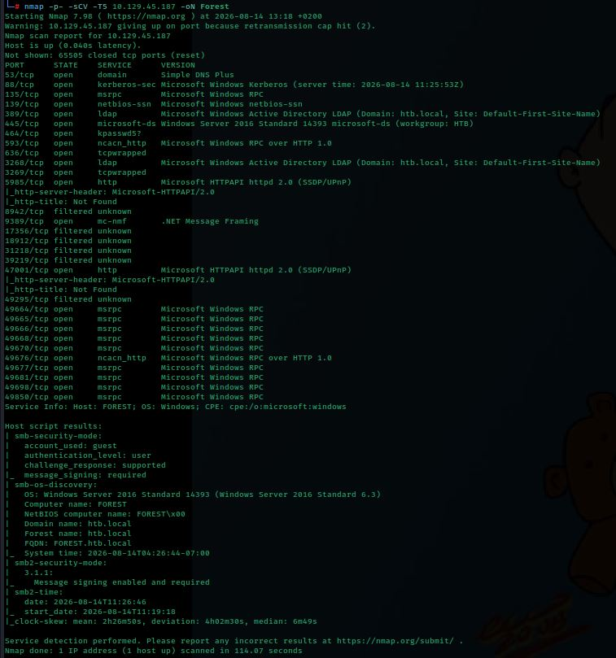

Relevant services found:

| Port | Service | Detail |
|---|---|---|
| 53/tcp | domain | Simple DNS Plus |
| 88/tcp | kerberos-sec | Microsoft Windows Kerberos |
| 135/tcp | msrpc | Microsoft Windows RPC |
| 139/tcp | netbios-ssn | Microsoft Windows netbios-ssn |
| 389/tcp | ldap | AD LDAP (domain: `htb.local`) |
| 445/tcp | microsoft-ds | Windows Server 2016 SMB |
| 464/tcp | kpasswd5 | Kerberos password change |
| 593/tcp | ncacn_http | RPC over HTTP |
| 636/tcp | ldapssl | LDAPS |
| 3268/tcp | ldap | Global Catalog |
| 3269/tcp | ldapssl | Global Catalog (SSL) |
| 5985/tcp | http | WinRM |
| 9389/tcp | mc-nmf | .NET Message Framing (AD Web Services) |
| 47001/tcp | http | WinRM (extra listener) |
| 49xxx/tcp | msrpc | Dynamic RPC ports |

Once again the classic **Domain Controller** fingerprint (DNS + Kerberos + LDAP + SMB), plus WinRM (5985) waiting for valid credentials. Nmap's `smb-os-discovery`/`smb2-time` scripts already leak useful info with zero authentication:

```
Computer name: FOREST
Domain name: htb.local
Forest name: htb.local
FQDN: FOREST.htb.local
```

> **Note:** "Forest" here has a double meaning — it's the box's name, but also a real AD term. A **forest** is the top-level container in Active Directory: it can group several **domains** that trust each other. In this lab the forest contains a single domain, `htb.local`.

The domain is added to `/etc/hosts`:

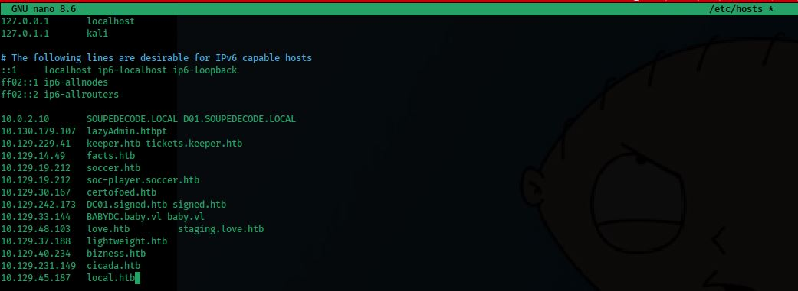

---

## Anonymous LDAP Enumeration

**LDAP** (Lightweight Directory Access Protocol, port 389) is the protocol Active Directory uses to store and query every object in the domain: users, groups, computers, policies... It's literally the domain's database, exposed over the network.

Many environments (and older Windows Server defaults) allow an **anonymous bind**: connecting to LDAP with no username or password and still being able to list directory objects. In AD terms, this is the equivalent of what SMB null sessions were for Cicada: a misconfiguration that leaks information without any credentials.

Checking whether the anonymous bind works:

```bash
ldapsearch -x -H ldap://10.129.45.187:389 -b "dc=htb,dc=local"
```

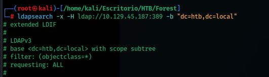

The server replies without requesting credentials, confirming the anonymous bind is allowed. `-b "dc=htb,dc=local"` sets the **base DN** (Distinguished Name) to start searching from — LDAP's way of representing "the htb.local domain" as a hierarchical path.

---

## User Enumeration with windapsearch

Raw `ldapsearch` output is powerful but painful to read. **windapsearch**, a Python tool built specifically for LDAP queries against Active Directory, formats results in a much more readable way.

```bash
git clone https://github.com/ropnop/windapsearch.git
cd windapsearch
```

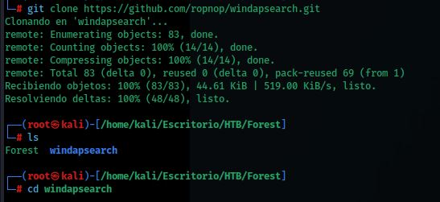

With the anonymous bind confirmed, every domain user is enumerated:

```bash
./windapsearch.py -d htb.local --dc-ip 10.129.45.187 -U
```

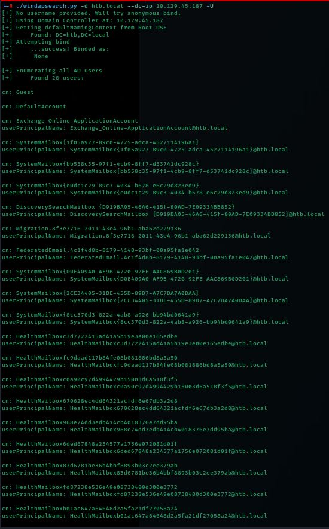
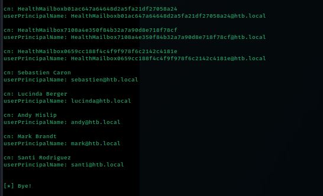

**28 users** are listed. Most are Exchange system mailboxes (`SystemMailbox{...}`, `HealthMailbox...`) auto-generated when Microsoft Exchange is installed, but several **real human accounts** stand out:

```
sebastien, lucinda, andy, mark, santi
```

More relevant to the next step, there's also a service account: **`svc-alfresco`**. Accounts prefixed `svc-` are typically service accounts (used by applications, not people) and tend to have looser configurations — a frequent target in AD environments.

A generic query is also run to confirm the scope of what the anonymous bind exposes:

```bash
./windapsearch.py -d htb.local --dc-ip 10.129.45.187 --custom "objectClass=*"
```

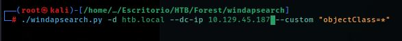

---

## ASREPRoasting

This is the core step of the initial-access phase, and one of the AD concepts that takes the longest to click the first time — so let's go slow.

### How Kerberos works (bare minimum)

When a user wants to authenticate in a domain with Kerberos, normally:

1. The client sends the KDC (Key Distribution Center, a role running on the DC) an **AS-REQ** (Authentication Service Request) containing a **timestamp encrypted with the user's password hash** (this is *pre-authentication*, or *pre-auth*). It's a "I know the password" proof without ever sending the password itself.
2. The KDC decrypts that timestamp using the hash it has stored for that user. If it matches and the timestamp is recent, it confirms the identity and replies with an **AS-REP** (Authentication Service Reply) containing a **TGT** (Ticket Granting Ticket) encrypted with the `krbtgt` account's hash — the special account that signs every ticket in the domain.

### The flaw: `UF_DONT_REQUIRE_PREAUTH`

Some accounts have pre-authentication disabled (an AD flag called `DONT_REQ_PREAUTH`). This means **anyone can request an AS-REP for that account without proving they know the password**. The KDC, without checking anything, still replies with a portion of the AS-REP **encrypted with the target user's password hash**.

That encrypted blob can be downloaded and, since it doesn't depend on any further network session, can be **cracked offline**, trying passwords until one correctly decrypts that block. This is called **ASREPRoasting**, and is conceptually the mirror image of Kerberoasting (which targets service tickets, TGS) but aimed at the initial AS-REP instead.

### Running the attack

Using the user list gathered earlier, the attack is tried against `svc-alfresco`:

```bash
impacket-GetNPUsers htb.local/svc-alfresco -dc-ip 10.129.45.187 -no-pass
```

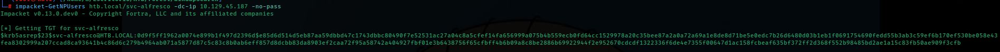

`-no-pass` is the key: no password is supplied at all, and the KDC still responds with the hash because `svc-alfresco` has pre-authentication disabled. A hash in the format `$krb5asrep$23$svc-alfresco@HTB.LOCAL:...` is obtained.

It's saved to a file for cracking:

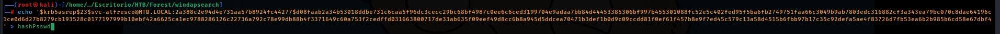

### Offline Cracking with John the Ripper

```bash
john hashPsswd --fork=4 --wordlist=/home/kali/Escritorio/rockyou.txt
```

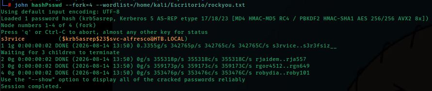

The hash falls quickly against the `rockyou.txt` wordlist:

```
s3rvice          ($krb5asrep$23$svc-alfresco@HTB.LOCAL)
```

Credential obtained: **svc-alfresco : s3rvice**

---

## Initial Access — WinRM

```bash
evil-winrm -i 10.129.45.187 -u svc-alfresco -p s3rvice
```

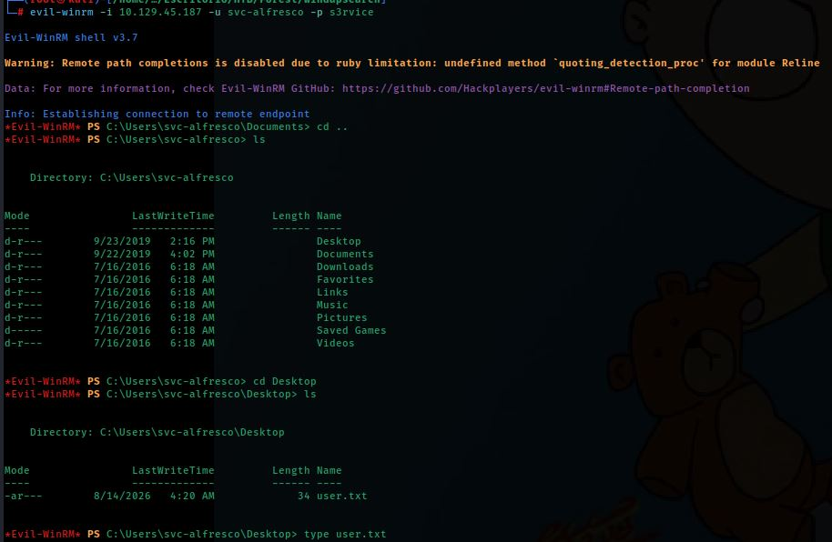

A shell is obtained as `svc-alfresco`. The desktop is browsed and `user.txt` is read.

**🚩 User flag captured.**

---

## Mapping the Domain with BloodHound

Once inside, the real question is: *what can `svc-alfresco` actually do in this domain, and how far can it reach?* Answering this manually (checking every group membership and every object's ACLs by hand) would be tedious and error-prone. That's exactly the problem **BloodHound** solves.

### What is BloodHound?

BloodHound models Active Directory as a **directed graph**: every object (user, group, computer, OU...) is a **node**, and every relationship between them (group membership, permissions one object holds over another, active sessions, etc.) is an **edge** with a specific type (`MemberOf`, `GenericAll`, `WriteDacl`, `AddKeyCredentialLink`...). Once the graph is loaded, questions like *"is there any path from this user to Domain Admins?"* can be answered automatically — something practically impossible to do by eye in a real domain with thousands of objects.

### Collecting Data with SharpHound

**SharpHound** is the "collector" — the executable that runs inside the domain, queries LDAP and SMB to pull all this information, and packages it into a ZIP of JSON files that gets imported into the BloodHound GUI (which runs on the attacking machine).

```powershell
upload SharpHound.exe
.\SharpHound.exe -c All
download 20260814052012_BloodHound.zip
```

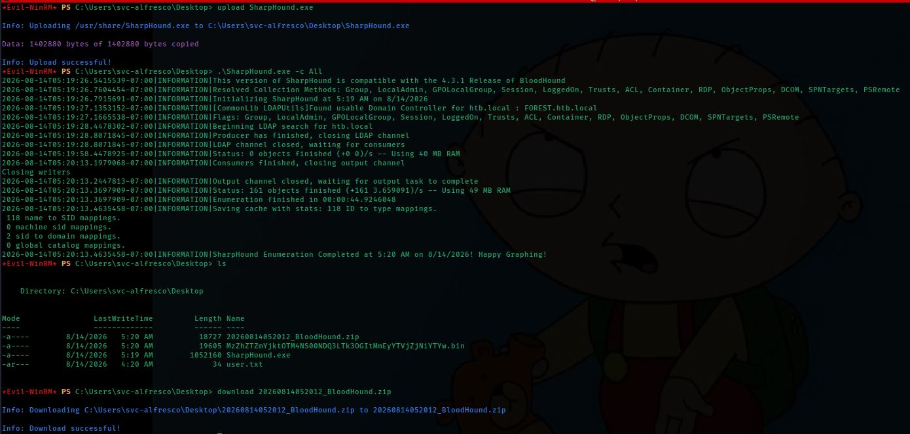

`-c All` collects **every** available data type (sessions, ACLs, group memberships, trust relationships, etc.) to build the most complete graph possible.

### Analyzing the Graph: Membership Chain

The ZIP is imported into BloodHound, and the `SVC-ALFRESCO@HTB.LOCAL` node is searched to see its direct relationships:

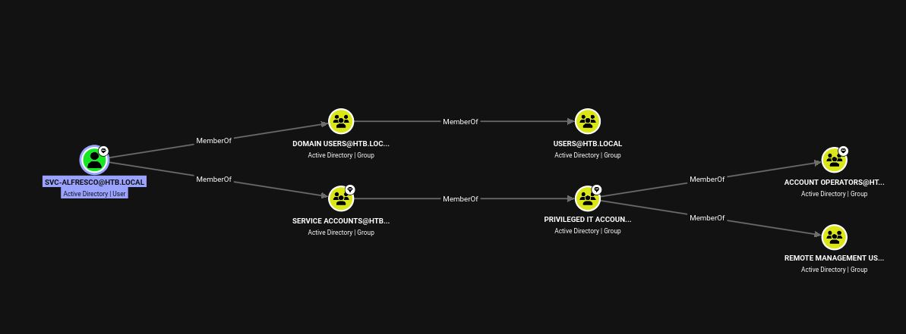

The following group membership chain is observed (remember: **group membership in AD is transitive/nested** — if group A is a member of group B, every member of A also inherits whatever B grants):

```
svc-alfresco
  └─ MemberOf → Service Accounts
        └─ MemberOf → Privileged IT Accounts
              └─ MemberOf → Account Operators
```

**`Account Operators`** is a Windows built-in group with an important privilege: its members can **create, modify, and delete user and group accounts** in the domain (with a few exceptions, like protected administrative groups). It was originally intended to delegate basic administrative tasks without granting full Domain Admin — but, as we'll see, when combined with other permissions it becomes a direct path to full domain compromise.

### Finding the Path to Domain Admins

Using BloodHound's **Pathfinding** feature, the shortest path between `SVC-ALFRESCO@HTB.LOCAL` and `DOMAIN ADMINS@HTB.LOCAL` is requested:

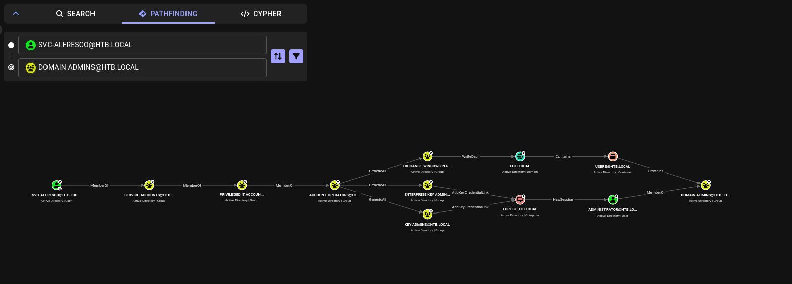

The graph reveals two possible paths, both starting from `Account Operators`:

```
Account Operators
   ├─ GenericAll → Exchange Windows Permissions
   │                        └─ WriteDacl → HTB.LOCAL (the domain)
   │                                            └─ Contains → Domain Admins
   │
   ├─ GenericAll → Enterprise Key Admins ─ AddKeyCredentialLink → FOREST.HTB.LOCAL (the DC)
   │                                                                    └─ HasSession → Administrator → MemberOf → Domain Admins
   │
   └─ GenericAll → Key Admins ─ AddKeyCredentialLink → FOREST.HTB.LOCAL (same path as above)
```

Translating each edge type:

- **`GenericAll`**: full control over the object. If `Account Operators` holds `GenericAll` over the `Exchange Windows Permissions` group, any member of `Account Operators` can **add members to that group** (among other things).
- **`WriteDacl`**: permission to **modify an object's DACL** (Discretionary Access Control List) — i.e., to **grant new permissions** over that object to anyone. `Exchange Windows Permissions` holds `WriteDacl` over the domain object `HTB.LOCAL` itself. This is a real, well-documented misconfiguration: installing Microsoft Exchange creates this group and grants it `WriteDacl` at the domain level so it can manage certain objects — a well-known case of privilege over-grant in real-world environments.
- **`AddKeyCredentialLink`**: allows linking a "key credential" (a certificate/public key) to an object, enabling the so-called **Shadow Credentials** attack — another way of taking over an account without knowing its password, by adding an alternative authentication method.

In short: **`svc-alfresco`, purely through nested group inheritance, ends up holding the power to rewrite permissions for the entire domain.**

---

## Exploiting the Privilege Chain

### 1. Creating a New Account (Account Operators privilege)

As an (indirect) member of `Account Operators`, `svc-alfresco` can create a brand-new domain user account:

```powershell
net user jujogova !23jjgv /add /domain
```

And add it to the two groups needed for the rest of the plan:

```powershell
net group "Exchange Windows Permissions" jujogova /add
net localgroup "Remote Management Users" jujogova /add
```

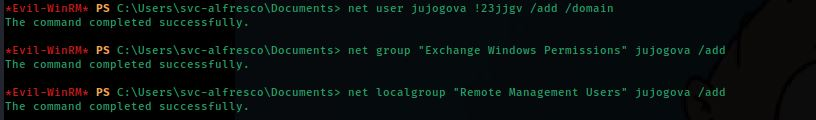

- Added to **`Exchange Windows Permissions`** because that's the group holding `WriteDacl` over the domain — the permission about to be abused.
- Added to **`Remote Management Users`** for a purely practical reason: that group is what authorizes an account to connect via **WinRM**. Without this, the new account couldn't be used to get a remote shell later.

### 2. Abusing WriteDacl to Grant DCSync (PowerView)

With `jujogova` now in `Exchange Windows Permissions`, `WriteDacl` over the domain is held. **PowerView** (a PowerShell library for attacking AD, part of the Empire framework) is used to add a new entry to the domain's DACL granting `jujogova` the rights needed to perform **DCSync**.

The tool is uploaded first:

```powershell
upload powerview.ps1
```

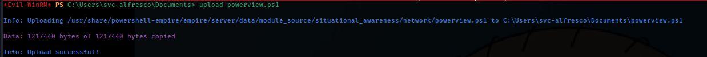

And the attack is run:

```powershell
. .\powerview.ps1
$pass = convertto-securestring '!23jjgv' -asplain -force
$cred = new-object system.management.automation.pscredential('htb\jujogova', $pass)
Add-ObjectACL -PrincipalIdentity jujogova -Credential $cred -Rights DCSync
```

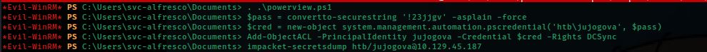

`Add-ObjectACL ... -Rights DCSync` adds two AD **extended rights** to the domain, granted to the `jujogova` account:

- `DS-Replication-Get-Changes`
- `DS-Replication-Get-Changes-All`

### What exactly is DCSync?

Under normal circumstances, these two rights are exclusive to **Domain Controllers** (and to Domain Admins/Enterprise Admins). They tell the domain: *"this account is allowed to request directory replication, just like another DC would."* In other words, holding these rights lets an attacker **impersonate a domain controller** and ask the real DC to "replicate" (send) directory data — including the **password hashes of every user in the domain** — without ever touching the `NTDS.dit` file directly or dumping `lsass.exe` memory. This technique is called **DCSync**, and it's one of the cleanest, most stealthy ways to fully compromise a domain once the right permissions are held.

### 3. Running the DCSync

```bash
impacket-secretsdump htb/jujogova@10.129.45.187
```

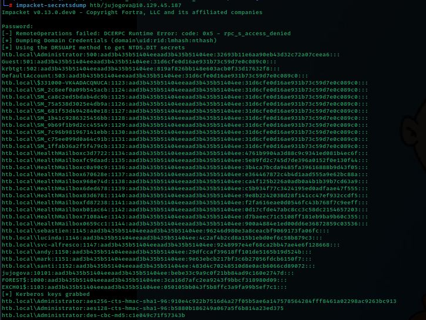

`secretsdump` speaks the **MS-DRSR** protocol (Directory Replication Service Remote Protocol) with the DC, requesting credential replication exactly like a legitimate domain controller would. The result is a full dump of `NTDS.dit` (AD's database, which holds — among other things — every password hash in the domain):

```
htb.local\Administrator:500:aad3b435b51404eeaad3b435b51404ee:32693b11e6aa90eb43d32c72a07ceea6:::
```

The **NTLM hash for `Administrator`** — the highest-privileged account in the domain — is obtained.

---

## Privilege Escalation — Pass-the-Hash with psexec

With Administrator's hash, authentication is done directly without cracking it, using **Pass-the-Hash**:

```bash
impacket-psexec administrator@10.129.45.187 -hashes aad3b435b51404eeaad3b435b51404ee:32693b11e6aa90eb43d32c72a07ceea6
```

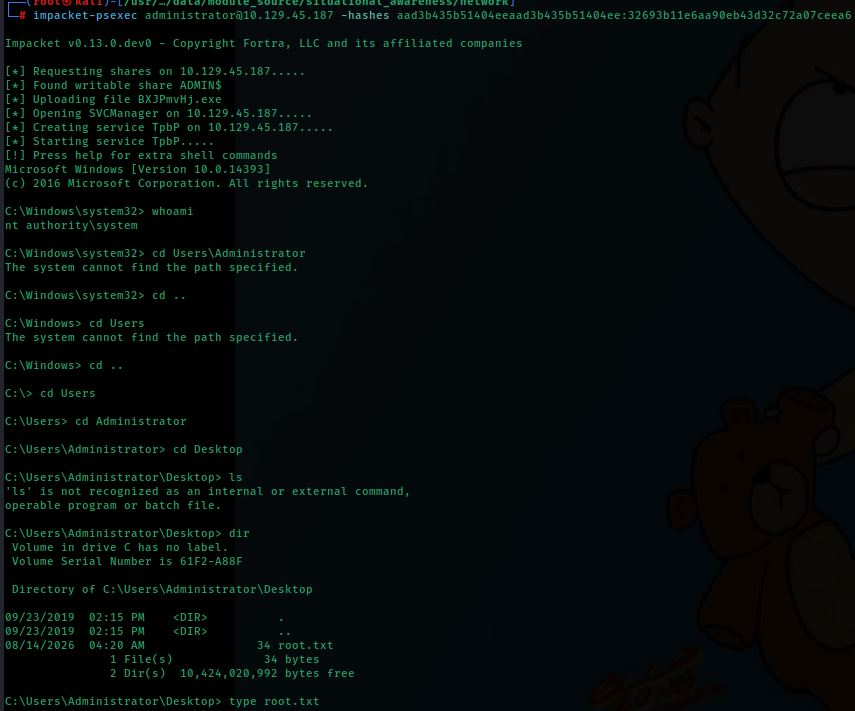

Unlike WinRM, `psexec` uploads a temporary service to the target's `ADMIN$` share and executes it through the **Service Control Manager**, resulting in a shell running as **`nt authority\system`** — a level even above Administrator, since SYSTEM is the identity the operating system itself uses.

```
C:\Windows\system32> whoami
nt authority\system
```

The Administrator desktop is browsed and the final flag is read:

```
C:\Users\Administrator\Desktop> type root.txt
```

**🚩 Root flag captured.**

---

## Attack Chain Summary

| Phase | Technique | Tool |
|---|---|---|
| Enumeration | Port Scan | `nmap` |
| LDAP enumeration | Anonymous bind | `ldapsearch` |
| User enumeration | Anonymous LDAP query | `windapsearch` |
| Initial credential | ASREPRoasting (`DONT_REQ_PREAUTH`) | `impacket-GetNPUsers` |
| Offline cracking | Dictionary attack against AS-REP | `john` + `rockyou.txt` |
| Initial access | WinRM | `evil-winrm` |
| AD mapping | Collection + graph analysis | `SharpHound` + `BloodHound` |
| Privilege abuse | Account creation (Account Operators) | `net user` / `net group` |
| Privilege escalation | `WriteDacl` abuse → DCSync grant | `PowerView` |
| Credential extraction | DCSync (MS-DRSR) | `impacket-secretsdump` |
| Final escalation | Pass-the-Hash | `impacket-psexec` |

---

## Key Concepts to Remember

- **Anonymous LDAP bind**: the AD-directory equivalent of an SMB null session. Lets you enumerate users without credentials if the DC is misconfigured.
- **ASREPRoasting**: targets accounts with Kerberos pre-authentication disabled; requires no prior credential at all, only knowing the username.
- **Nested group membership**: permissions in AD "travel" through chains of groups. Always think in full chains, not just direct memberships.
- **BloodHound**: turns "can I reach Domain Admin?" into a graph pathfinding problem instead of a manual object-by-object review.
- **`GenericAll` / `WriteDacl`**: AD object control rights that, when chained together, allow privilege escalation without exploiting any software bug — just misconfigured permissions.
- **DCSync**: with the right replication rights, any account can impersonate a Domain Controller and pull every hash in the domain.
- **Pass-the-Hash**: an NTLM hash is, for authentication purposes, as good as the password itself — no cracking is needed if only authentication (not the plaintext password) is the goal.
